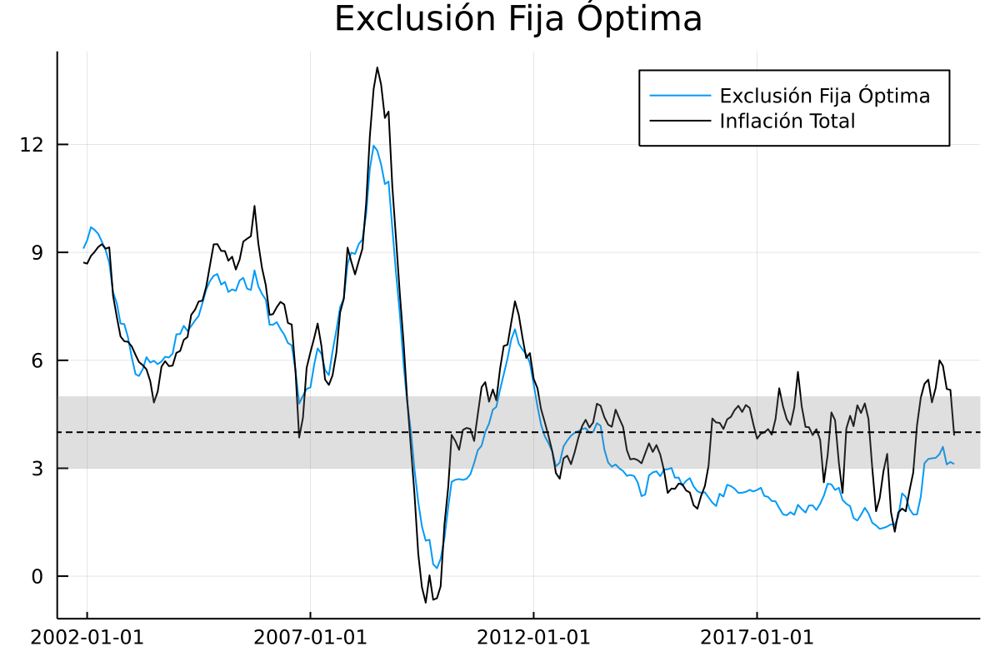
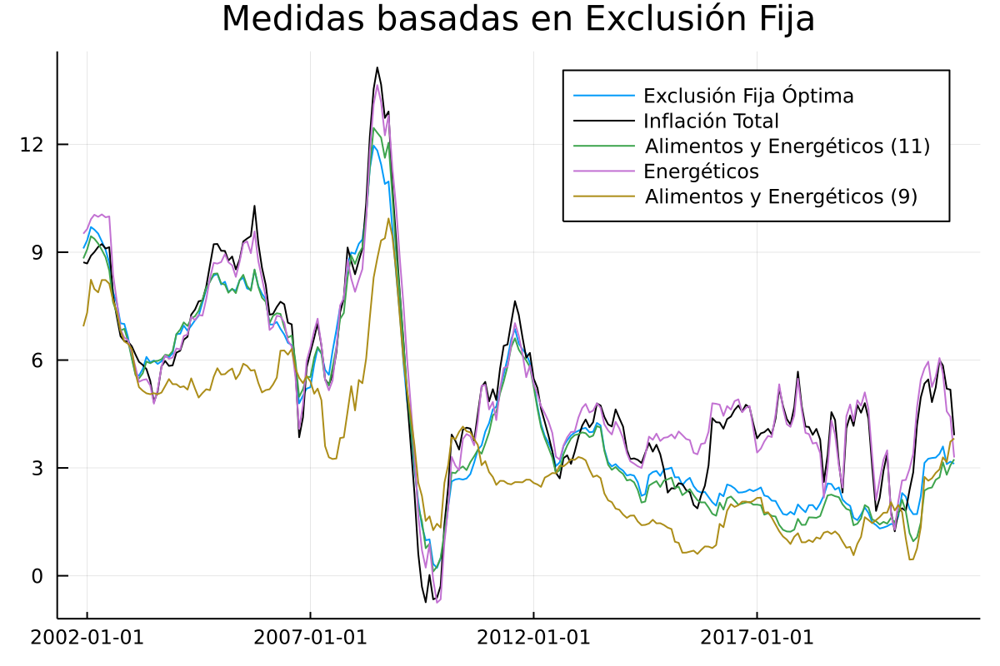

# Medidas Basadas en Exclusión Fija 

En esta sección se documentan los resultados del proceso de evaluación de las medidas de inflación interanual basadas en Exclusión fija.

Evaluación de medidas de exclusión fija evaluadas
 1. Exclusión Fija de Alimentos y energéticos variante 11
 2. Exclusión Fija de Energéticos 
 3. Exclusión Fija de Alimentos y energéticos variante 9
 4. Exclusión Fija Óptima 

### Exclusión Fija Óptima

En total, luego del proceso de optimización, se excluyen 14 gastos básicos de la base 2000 y 17 gastos básicos de la Base 2010:

| Exclusiones Base 2000                                                             |
|:---------------------------------------------------------------------------------:|
| Cebolla                                                                           |
| Tomate                                                                            |
| Otras cuotas fijas y extraordinarias en la educación preprimaria y primaria       |
| Papa o patata                                                                     |
| Zanahoria                                                                         |
| Culantro o cilantro                                                               |
| Güisquil                                                                          |    
| Gastos derivados del gas manufacturado y natural y gases licuados del petróleo    |
| Transporte aéreo                                                                  |
| Otras verduras y hortalizas                                                       |
| Frijol                                                                            |
| Gasolina                                                                          |
| Otras cuotas fijas y extraordinarias en la educación secundaria                   |
| Transporte urbano                                                                 |

| Exclusiones Base 2010             |
|:---------------------------------:|
| Tomate                            |
| Chile pimiento                    |
| Gas propano                       |
| Cebolla                           |
| Culantro                          |
| Papa                              |
| Güisquil                          |    
| Lechuga                           |
| Diesel                            |
| Hierbabuena                       |
| Servicio de transporte aéreo      |
| Zanahoria                         |
| Aguacate                          |
| Otras legumbres y hortalizas      |
| Gasolina regular                  |
| Repollo                           |
| Gasolina superior                 |

## Resultados de evaluación con criterios básicos a diciembre de 2019

| Medida                     | MSE      | Error Estándar | 
|:---------------------------|---------:|---------------:|
| Exclusión Óptima           |   0.6422 |        0.0006  |
| Alimentos y Energéticos 11 |   0.8667 |        0.0016  |
| Alimentos y Energéticos 9  |   3.1216 |         0.003  |
| Energéticos                |  82.0842 |        2.3344  | 

## Descomposición aditiva del MSE

|                     Medida | Comp. Sesgo |  Comp. Varianza |  Comp. Covarianza | 
|:---------------------------|------------:|----------------:|------------------:|
|           Exclusión Óptima |       0.1263|           0.1408|             0.3752|
| Alimentos y Energéticos 11 |       0.1836|           0.2534|             0.4297|
|  Alimentos y Energéticos 9 |       2.3603|           0.1495|             0.6117|
|                Energéticos |      10.4907|          62.9358|             8.6577|

## Métricas de evaluación 

|                     Medida |     RMSE |       ME |      MAE |    Huber | Correlación |
|:---------------------------|---------:|---------:|---------:|---------:|------------:|
|           Exclusión Óptima |   0.7919 |  -0.3051 |   0.6407 |   0.2901 |      0.9731 |
| Alimentos y Energéticos 11 |   0.9102 |  -0.3668 |   0.7396 |   0.3659 |      0.9707 |
|  Alimentos y Energéticos 9 |   1.7542 |  -1.5135 |   1.5924 |   1.1134 |       0.954 |
|                Energéticos |   4.2484 |   1.6031 |   2.3149 |   1.9144 |      0.7678 |

## Trayectorias de inflación observada

### Exclusión Fija óptima

### Medidas de Exclusión Fija
