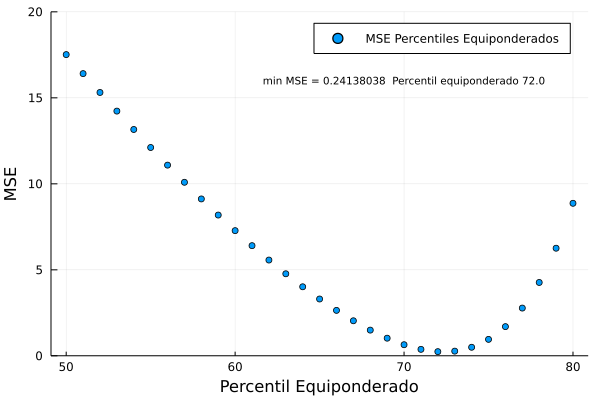

# Percentiles 

En esta sección se documentan los resultados del proceso de evaluación de las medidas de inflación interanual basadas en la metodología de percentiles ponderados y equiponderados.

## Resultados de evaluación con criterios básicos a diciembre de 2019

### Percentiles ponderados y equiponderados

| Medida                        |    MSE | Error estándar |
|:----------------------------- | ------:| --------------:|
| Percentil ponderado 70.0      | 0.4067 |         0.0003 |
| Percentil equiponderado 72.0  | 0.2414 |         0.0001 |

## Descomposición aditiva del MSE

### Percentiles ponderados y equiponderados

| Medida                       |    MSE | Comp. Sesgo | Comp. Varianza | Comp. Covarianza |
|:---------------------------- | ------:| -----------:| --------------:| ----------------:|
| Percentil ponderado 70.0     | 0.4067 |      0.0188 |         0.0357 |           0.3522 |
| Percentil equiponderado 72.0 | 0.2414 |      0.0043 |         0.0601 |           0.1769 |

## Métricas de evaluación 

### Percentiles ponderados y equiponderados

| Medida                       |   RMSE | Error medio |    MAE |  Huber | Correlación |
|:---------------------------- | ------:| -----------:| ------:| ------:| -----------:|
| Percentil ponderado 70.0     | 0.6321 |     -0.0938 | 0.5065 | 0.1936 |      0.9732 |
| Percentil equiponderado 72.0 | 0.4882 |     -0.0361 | 0.3562 | 0.1156 |      0.9842 |

## Trayectoria de inflación observada

### Percentiles ponderados 

### Percentiles equiponderados

## Evaluación gráfica de percentiles 

### Percentiles ponderados 

### Percentiles equiponderados
