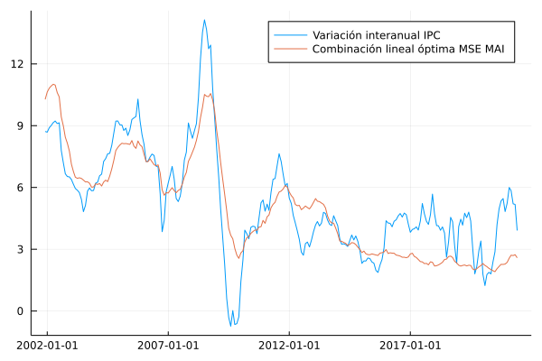

# Subyacente MAI 

En esta sección se documentan los resultados del proceso de evaluación de las medidas de inflación interanual basadas en la metodología de muestra ampliada implícitamente (MAI).

## Resultados de evaluación con criterios básicos a diciembre de 2019

### Evaluación de metodologías MAI-F

| Medida     |    MSE | Error estándar |
| :--------- | -----: | -------------: |
| MAI (F,4)  | 0.3720 |         0.0004 |
| MAI (F,5)  | 0.3084 |         0.0003 |
| MAI (F,10) | 0.3811 |         0.0003 |
| MAI (F,20) | 0.8218 |         0.0005 |
| MAI (F,40) | 1.1691 |         0.0007 |

### Evaluación de metodologías MAI-G

| Medida     |    MSE | Error estándar |
| :--------- | -----: | -------------: |
| MAI (G,4)  | 0.8841 |         0.0006 |
| MAI (G,5)  | 0.8968 |         0.0006 |
| MAI (G,10) | 0.7098 |         0.0006 |
| MAI (G,20) | 0.6840 |         0.0006 |
| MAI (G,40) | 0.7861 |         0.0007 |

### Evaluación de metodologías MAI-FP

| Medida      |    MSE | Error estándar |
| :---------- | -----: | -------------: |
| MAI (FP,3)  | 0.2727 |         0.0002 |
| MAI (FP,4)  |  0.315 |         0.0002 |
| MAI (FP,5)  | 0.2556 |         0.0002 |
| MAI (FP,8)  | 0.3511 |         0.0003 |
| MAI (FP,10) | 0.4583 |         0.0004 |
| MAI (FP,20) | 0.9323 |         0.0006 |
| MAI (FP,40) | 1.3337 |         0.0007 |

### Combinación lineal óptima 

| Medida     | Ponderador |
| ---------- | ---------: |
| MAI (F,4)  |    0.78338 |
| MAI (F,5)  |   -0.27381 |
| MAI (F,10) |    0.23939 |
| MAI (F,20) |   -0.09705 |
| MAI (F,40) |    0.16584 |
| MAI (G,4)  |    0.11850 |
| MAI (G,5)  |    -0.0408 |
| MAI (G,10) |   -0.02522 |
| MAI (G,20) |    0.04821 |
| MAI (G,40) |    0.05460 |

| Medida          |    MSE | Error estándar |
| :-------------- | -----: | -------------: |
| Combinación MAI | 0.2172 |         0.0002 |

## Descomposición aditiva del MSE

### Metodologías MAI-F
| Medida     |    MSE | Comp. Sesgo | Comp. Varianza | Comp. Covarianza |
| :--------- | -----: | ----------: | -------------: | ---------------: |
| MAI (F,4)  |  0.372 |      0.1304 |         0.0169 |           0.2248 |
| MAI (F,5)  | 0.3084 |      0.0848 |         0.0078 |           0.2158 |
| MAI (F,10) | 0.3811 |      0.0474 |         0.1208 |            0.213 |
| MAI (F,20) | 0.8218 |      0.0458 |         0.3185 |           0.4576 |
| MAI (F,40) | 1.1691 |      0.0447 |         0.4066 |           0.7178 |

### Metodologías MAI-FP
| Medida      |    MSE | Comp. Sesgo | Comp. Varianza | Comp. Covarianza |
| :---------- | -----: | ----------: | -------------: | ---------------: |
| MAI (FP,3)  | 0.2727 |      0.0492 |         0.0189 |           0.2047 |
| MAI (FP,4)  |  0.315 |       0.057 |         0.0283 |           0.2297 |
| MAI (FP,5)  | 0.2556 |      0.0264 |         0.0061 |           0.2231 |
| MAI (FP,8)  | 0.3511 |      0.0721 |         0.0975 |           0.1816 |
| MAI (FP,10) | 0.4583 |      0.0771 |         0.1749 |           0.2063 |
| MAI (FP,20) | 0.9323 |      0.0461 |         0.4659 |           0.4203 |
| MAI (FP,40) | 1.3337 |      0.0444 |         0.5985 |           0.6909 |

### Metodologías MAI-G

| Medida     |    MSE | Comp. Sesgo | Comp. Varianza | Comp. Covarianza |
| :--------- | -----: | ----------: | -------------: | ---------------: |
| MAI (G,4)  | 0.8841 |      0.0664 |         0.3698 |           0.4479 |
| MAI (G,5)  | 0.8968 |      0.0417 |         0.3682 |           0.4869 |
| MAI (G,10) | 0.7098 |      0.0937 |         0.1445 |           0.4717 |
| MAI (G,20) |  0.684 |       0.103 |         0.0657 |           0.5152 |
| MAI (G,40) | 0.7861 |       0.091 |         0.0993 |           0.5957 |

### Combinación lineal óptima 

| Medida          |    MSE | Comp. Sesgo | Comp. Varianza | Comp. Covarianza |
| :-------------- | -----: | ----------: | -------------: | ---------------: |
| Combinación MAI | 0.2172 |      0.0386 |         0.0119 |           0.1667 |

## Métricas de evaluación 

### Metodologías MAI-F
| Medida     |   RMSE | Error medio |    MAE |  Huber | Correlación |
| :--------- | -----: | ----------: | -----: | -----: | ----------: |
| MAI (F,4)  | 0.5984 |      0.2992 | 0.4805 | 0.1812 |      0.9826 |
| MAI (F,5)  | 0.5464 |      0.2093 | 0.4407 | 0.1512 |      0.9824 |
| MAI (F,10) | 0.6101 |     -0.0803 |  0.479 | 0.1805 |      0.9802 |
| MAI (F,20) | 0.9007 |     -0.0203 | 0.7652 | 0.3754 |      0.9526 |
| MAI (F,40) | 1.0759 |     -0.0069 | 0.9359 | 0.5141 |      0.9228 |

### Metodologías MAI-G
| Medida     |   RMSE | Error medio |    MAE |  Huber | Correlación |
| :--------- | -----: | ----------: | -----: | -----: | ----------: |
| MAI (G,4)  | 0.9332 |      0.1589 | 0.7923 | 0.3985 |      0.9708 |
| MAI (G,5)  | 0.9409 |     -0.0288 | 0.8113 | 0.4093 |      0.9683 |
| MAI (G,10) | 0.8344 |     -0.2231 | 0.6836 | 0.3234 |      0.9665 |
| MAI (G,20) | 0.8182 |     -0.2405 | 0.6563 | 0.3078 |      0.9612 |
| MAI (G,40) | 0.8774 |     -0.2053 | 0.7029 |  0.346 |      0.9561 |

### Metodologías MAI-FP
| Medida      |   RMSE | Error medio |    MAE |  Huber | Correlación |
| :---------- | -----: | ----------: | -----: | -----: | ----------: |
| MAI (FP,3)  | 0.5183 |      0.1754 | 0.4215 |  0.135 |      0.9826 |
| MAI (FP,4)  | 0.5561 |      0.1977 | 0.4388 |  0.155 |      0.9826 |
| MAI (FP,5)  | 0.5010 |      0.0922 | 0.3916 | 0.1258 |      0.9822 |
| MAI (FP,8)  | 0.5852 |     -0.2335 | 0.4314 | 0.1642 |      0.9834 |
| MAI (FP,10) | 0.6700 |     -0.2435 | 0.5133 | 0.2116 |      0.9801 |
| MAI (FP,20) | 0.9601 |     -0.1603 | 0.8261 | 0.4192 |      0.9536 |
| MAI (FP,40) | 1.1498 |     -0.1556 | 1.0215 | 0.5795 |      0.9196 |

### Combinación lineal óptima 

| Medida          |   RMSE | Error medio |    MAE |  Huber | Correlación |
| :-------------- | -----: | ----------: | -----: | -----: | ----------: |
| Combinación MAI | 0.4599 |      0.0099 | 0.3554 | 0.1064 |      0.9861 |

## Trayectoria de inflación observada

## Optimización de cuantiles 

Resultados del proceso de optimización de cuantiles utilizando $n \in \lbrace 3,4,5,10 \rbrace$. 

| Medida                                                              |    MSE | Error estándar |
| :------------------------------------------------------------------ | -----: | -------------: |
| MAI (FP,4,[0.32, 0.71, 0.77])                                       | 0.2064 |         0.0001 |
| MAI (F,4,[0.26, 0.7, 0.81])                                         | 0.2191 |         0.0002 |
| MAI (G,10,[0.05, 0.24, 0.3, 0.6, 0.62, 0.65, 0.72, 0.7633, 0.7643]) | 0.4732 |         0.0004 |
| Combinación MAI                                                     | 0.2029 |         0.0002 |

### Ponderadores de combinación lineal 

| Medida                                                              | Ponderador |
| :------------------------------------------------------------------ | ---------: |
| MAI (FP,4,[0.32, 0.71, 0.77])                                       |     0.7034 |
| MAI (F,4,[0.26, 0.7, 0.81])                                         |     0.3006 |
| MAI (G,10,[0.05, 0.24, 0.3, 0.6, 0.62, 0.65, 0.72, 0.7633, 0.7643]) |    -0.0022 |

### Descomposición aditiva del MSE

| Medida                                                              |    MSE | Comp. Sesgo | Comp. Varianza | Comp. Covarianza |
| :------------------------------------------------------------------ | -----: | ----------: | -------------: | ---------------: |
| MAI (FP,4,[0.32, 0.71, 0.77])                                       | 0.2064 |      0.0185 |         0.0042 |           0.1836 |
| MAI (F,4,[0.26, 0.7, 0.81])                                         | 0.2191 |      0.0394 |         0.0056 |           0.1741 |
| MAI (G,10,[0.05, 0.24, 0.3, 0.6, 0.62, 0.65, 0.72, 0.7633, 0.7643]) | 0.4732 |       0.043 |         0.0208 |           0.4094 |
| Combinación MAI                                                     | 0.2029 |      0.0200 |         0.0042 |           0.1788 |

### Métricas de evaluación 

| Medida                                                              |   RMSE | Error medio |    MAE |  Huber | Correlación |
| :------------------------------------------------------------------ | -----: | ----------: | -----: | -----: | ----------: |
| MAI (FP,4,[0.32, 0.71, 0.77])                                       | 0.4507 |     -0.0295 | 0.3493 | 0.1017 |      0.9851 |
| MAI (F,4,[0.26, 0.7, 0.81])                                         | 0.4624 |     -0.0131 | 0.3617 | 0.1078 |      0.9859 |
| MAI (G,10,[0.05, 0.24, 0.3, 0.6, 0.62, 0.65, 0.72, 0.7633, 0.7643]) | 0.6799 |     -0.0123 | 0.5374 |  0.221 |      0.9674 |
| Combinación MAI                                                     | 0.4469 |     -0.0144 | 0.3475 | 0.1001 |      0.9855 |

### Trayectoria de inflación observada

