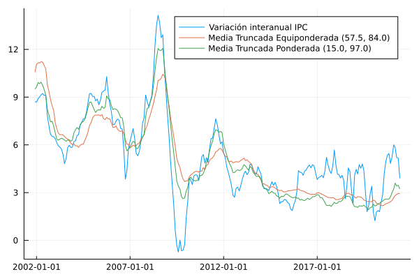

# Medias truncadas

En esta sección se documentan los resultados del proceso de evaluación de las medidas de inflación interanual basadas en la metodología de medias truncadas.

## Resultados de evaluación con criterios básicos a diciembre de 2019

| Medida           |      MSE | Error estándar |
|:-----------------|---------:|---------------:|
| MTEq-(57.5,84.0) |   0.2173 |         0.0001 |
|  MTW-(15.0,97.0) |    0.295 |         0.0002 |

## Descomposición aditiva del MSE

| Medida                |    MSE | Comp. Sesgo | Comp. Varianza | Comp. Covarianza |
|:--------------------- | ------:| -----------:| --------------:| ----------------:|
| MTEq-(57.5,84.0)      | 0.2173 |      0.0097 |         0.0404 |           0.1672 |
|  MTW-(15.0,97.0)      |  0.295 |      0.0092 |         0.0118 |            0.274 |

## Métricas de evaluación 

| Medida                |   RMSE | Error medio |    MAE |  Huber | Correlación |
|:--------------------- | ------:| -----------:| ------:| ------:| -----------:|
| MTEq-(57.5,84.0)      | 0.4638 |      0.0846 | 0.3624 | 0.1063 |      0.9854 |
|  MTW-(15.0,97.0)      | 0.5373 |     -0.0134 | 0.4183 | 0.1425 |      0.9776 |

## Trayectoria de inflación observada

