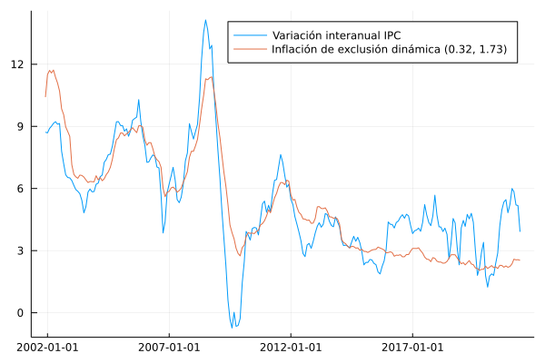

# Exclusión dinámica

En esta sección se documentan los resultados del proceso de evaluación de las medidas de inflación interanual basadas en la metodología de exclusión dinámica.

## Resultados de evaluación con criterios básicos a diciembre de 2019

### Exclusión dinámica con factores (0.3222, 1.7283)

| Medida                |    MSE | Error estándar |
|:--------------------- | ------:| --------------:|
| dynEx(0.3222, 1.7283) | 0.2910 |         0.0002 |

## Descomposición aditiva del MSE

### Exclusión dinámica con factores (0.3222, 1.7283)

| Medida                |    MSE | Comp. Sesgo | Comp. Varianza | Comp. Covarianza |
|:--------------------- | ------:| -----------:| --------------:| ----------------:|
| dynEx(0.3222, 1.7283) | 0.2910 |      0.0085 |         0.0149 |           0.2675 |

## Métricas de evaluación 

### Exclusión dinámica con factores (0.3222, 1.7283)
| Medida                |   RMSE | Error medio |    MAE |  Huber | Correlación |
|:--------------------- | ------:| -----------:| ------:| ------:| -----------:|
| dynEx(0.3222, 1.7283) | 0.5336 |     -0.0002 | 0.4059 | 0.1392 |      0.9779 |

## Trayectoria de inflación observada

