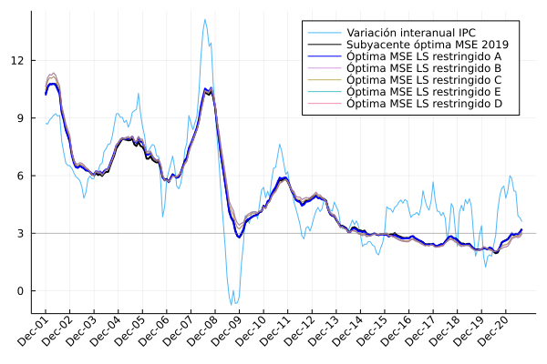

# Combinación lineal MSE  

En esta sección se documentan los resultados del proceso de combinación y
evaluación fuera de muestra de los estimadores de inflación obtenidos. 

## Metodología de evaluación fuera de muestra
La metodología de evlauación puede resumirse en dos pasos: 

1. Se obtienen trayectorias hasta un determinado período, denominado de
   *entrenamiento*. 
2. Se combinan las trayectorias de inflación del período de entrenamiento
   utilizando un método de combinación lineal para obtener ponderadores. Los
   diferentes métodos de combinación lineal utilizados se describen en la
   sección siguiente. Posteriormente, la trayectoria combinada es evaluada en un
   determinado período posterior al período de entrenamiento, utilizando los
   mismos ponderadores obtenidos en el período de entrenamiento. Se denomina
   este período como *período de validación* o *prueba*. 

Este proceso se repite durante varios períodos para obtener una métrica de
validación cruzada. La métrica de validación cruzada permite calibrar los
hiperparámetros en los métodos de combinación lineal, tales como: 

- El subperíodo de entrenamiento: se evalúa la disyuntiva entre utilizar todo el
  período de entrenamiento o el subperíodo de la base 2010 del IPC. 
- El parámetro de regularización $\lambda$ del método de combinación Ridge.
- Incluir en la combinación lineal de estimadores la medida de exclusión fija de
  gastos básicos.
- Agregar un intercepto en la combinación lineal. 

Los períodos de entrenamiento y validación utilizados son los siguientes: 

|  No.  |    Entrenamiento    |   Validación    |
| :---: | :-----------------: | :-------------: |
|   1   | Dic-2001 a Dic-2012 | Ene-13 a Dic-14 |
|   2   | Dic-2001 a Dic-2013 | Ene-14 a Dic-15 |
|   3   | Dic-2001 a Dic-2014 | Ene-15 a Dic-16 |
|   4   | Dic-2001 a Dic-2015 | Ene-16 a Dic-17 |
|   5   | Dic-2001 a Dic-2016 | Ene-17 a Dic-18 |
|   6   | Dic-2001 a Dic-2017 | Ene-18 a Dic-19 |

Finalmente, se reserva un período de prueba, el cual no es utilizado para
calibrar ningún hiperparámetro y así tener una medida del desempeño final de
cada método de combinación. El período de prueba es el siguiente:

|  No.  |    Entrenamiento    |     Prueba      |
| :---: | :-----------------: | :-------------: |
|   1   | Dic-2001 a Dic-2019 | Ene-20 a Dic-20 |

## Métodos de combinación lineal

Se evalúan los siguientes métodos de combinación lineal: 
1. Ponderadores de mínimos cuadrados (LS, por las siglas en inglés *Least Squares*). 
2. Ponderadores de mínimos cuadrados con regularización Ridge. 
4. Ponderadores de mínimos cuadrados restringidos.

## Escenarios de hiperparámetros 

Se consideran cinco escenarios de calibración de hiperparámetros: 
1. **Escenario A**: 
   - Se incluyen todos los estimadores de inflación calibrados hasta diciembre de 2018. 
   - Los ponderadores de combinación se obtienen en el período completo de entrenamiento. 
2. **Escenario B**: 
   - Se incluyen todos los estimadores de inflación calibrados hasta diciembre de 2018. 
   - Los ponderadores de combinación se obtienen en el subperíodo de entrenamiento comprendido a partir de diciembre de 2011. 
3. **Escenario C**: 
   - Se incluyen todos los estimadores de inflación calibrados hasta diciembre de 2018. 
   - Los ponderadores de combinación se obtienen en el subperíodo de entrenamiento comprendido a partir de diciembre de 2011. 
   - Se agrega un intercepto en la combinación lineal de estimadores.  
4. **Escenario D**: 
   - Se incluyen todos los estimadores de inflación calibrados hasta diciembre de 2018, excepto el estimador de exclusión fija de gastos básicos
   - Los ponderadores de combinación se obtienen en el subperíodo de entrenamiento comprendido a partir de diciembre de 2011. 
   - Se agrega un intercepto en la combinación lineal de estimadores.  
5. **Escenario E**: 
   - Se incluyen todos los estimadores de inflación calibrados hasta diciembre de 2018, excepto el estimador de exclusión fija de gastos básicos
   - Los ponderadores de combinación se obtienen en el subperíodo de entrenamiento comprendido a partir de diciembre de 2011. 

## Combinación lineal de mínimos cuadrados 

| Escenario | MSE CV | MSE Prueba |
| :-------: | -----: | ---------: |
|     A     | 0.1298 |     0.1348 |
|     B     | 0.1488 |      0.246 |
|     C     | 0.6308 |     0.2798 |
|     E     | 0.1492 |     0.2815 |
|     D     | 0.6255 |     0.3014 |

Las componentes de la combinación lineal del escenario con la mejor métrica de prueba son: 

| Medida de inflación                          | Ponderación |
| :------------------------------------------- | ----------: |
| Percentil equiponderado 72.0                 |     -0.3518 |
| Percentil ponderado 70.0                     |      0.0147 |
| Media Truncada Equiponderada (57.5, 84.0)    |      1.0918 |
| Media Truncada Ponderada (15.0, 97.0)        |     -0.1436 |
| Inflación de exclusión dinámica (0.32, 1.73) |     -0.0781 |
| Exclusión fija de gastos básicos(14, 17)     |      0.2863 |
| MAI óptima MSE 2019                          |      0.1792 |

### Trayectorias de inflación observada

## Combinación lineal Ridge

| Escenario | $\lambda$ | MSE CV | MSE Prueba |
| :-------: | --------: | -----: | ---------: |
|     C     |       0.1 | 0.8548 |     0.2599 |
|     D     |       0.0 | 0.6255 |     0.3014 |
|     B     |       1.9 | 0.1172 |     0.3261 |
|     A     |       6.7 | 0.0927 |     0.3371 |
|     E     |      1.28 | 0.1177 |     0.3595 |

Las componentes de la combinación lineal del escenario con la mejor métrica de prueba son: 

| Medida de inflación                          | Ponderación |
| :------------------------------------------- | ----------: |
| Variación interanual constante igual a 1.0   |      0.1258 |
| Percentil equiponderado 72.0                 |      0.2265 |
| Percentil ponderado 70.0                     |      0.0792 |
| Media Truncada Equiponderada (57.5, 84.0)    |      0.2398 |
| Media Truncada Ponderada (15.0, 97.0)        |      0.0561 |
| Inflación de exclusión dinámica (0.32, 1.73) |      0.1013 |
| Exclusión fija de gastos básicos(14, 17)     |      0.0649 |
| MAI óptima MSE 2019                          |      0.1796 |

### Trayectorias de inflación observada

## Combinación lineal restringida

| Escenario | MSE CV | MSE Prueba |
| :-------: | -----: | ---------: |
|     A     | 0.0946 |     0.1588 |
|     B     | 0.1167 |     0.2276 |
|     C     | 0.1624 |     0.2276 |
|     E     | 0.1205 |     0.2706 |
|     D     | 0.1662 |     0.2706 |

Las componentes de la combinación lineal del escenario con la mejor métrica de prueba son: 

| Medida de inflación                          | Ponderación |
| :------------------------------------------- | ----------: |
| Percentil equiponderado 72.0                 |         0.0 |
| Percentil ponderado 70.0                     |         0.0 |
| Media Truncada Equiponderada (57.5, 84.0)    |      0.6593 |
| Media Truncada Ponderada (15.0, 97.0)        |         0.0 |
| Inflación de exclusión dinámica (0.32, 1.73) |         0.0 |
| Exclusión fija de gastos básicos(14, 17)     |      0.2442 |
| MAI óptima MSE 2019                          |      0.0965 |

### Trayectorias de inflación observada

## Evaluación a diciembre de 2020

### MSE en período base 2010

El MSE base 2010 es obtenido para cada configuración en el período de diciembre de 2011 a diciembre de 2020. Los datos se encuentran ordenados por MSE de validación.

| Método       | Escenario | MSE CV | MSE Prueba | MSE base 2010 | Error estándar |
| :----------- | :-------: | -----: | ---------: | ------------: | -------------: |
| Ridge        |     A     | 0.0927 |     0.3371 |        0.1121 |         0.0004 |
| Restringidos |     A     | 0.0946 |     0.1588 |        0.0706 |         0.0002 |
| Restringidos |     B     | 0.1167 |     0.2276 |        0.0714 |         0.0002 |
| Ridge        |     B     | 0.1172 |     0.3261 |        0.1038 |         0.0003 |
| Ridge        |     E     | 0.1177 |     0.3595 |        0.1013 |         0.0003 |
| Restringidos |     E     | 0.1205 |     0.2706 |         0.077 |         0.0002 |
| LS           |     A     | 0.1298 |     0.1348 |        0.0707 |         0.0002 |
| LS           |     B     | 0.1488 |      0.246 |         0.071 |         0.0002 |
| LS           |     E     | 0.1492 |     0.2815 |        0.0757 |         0.0002 |
| Restringidos |     C     | 0.1624 |     0.2276 |        0.0714 |         0.0002 |
| Restringidos |     D     | 0.1662 |     0.2706 |         0.077 |         0.0002 |
| LS           |     D     | 0.6255 |     0.3014 |        0.0765 |         0.0002 |
| Ridge        |     D     | 0.6255 |     0.3014 |        0.0765 |         0.0002 |
| LS           |     C     | 0.6308 |     0.2798 |        0.0736 |         0.0002 |
| Ridge        |     C     | 0.8548 |     0.2599 |        0.0784 |         0.0002 |

Ordenados por MSE de prueba: 

| Método       | Escenario | MSE CV | MSE Prueba | MSE base 2010 | Error estándar |
| :----------- | :-------: | -----: | ---------: | ------------: | -------------: |
| LS           |     A     | 0.1298 |     0.1348 |        0.0707 |         0.0002 |
| Restringidos |     A     | 0.0946 |     0.1588 |        0.0706 |         0.0002 |
| Restringidos |     B     | 0.1167 |     0.2276 |        0.0714 |         0.0002 |
| Restringidos |     C     | 0.1624 |     0.2276 |        0.0714 |         0.0002 |
| LS           |     B     | 0.1488 |      0.246 |         0.071 |         0.0002 |
| Ridge        |     C     | 0.8548 |     0.2599 |        0.0784 |         0.0002 |
| Restringidos |     E     | 0.1205 |     0.2706 |         0.077 |         0.0002 |
| Restringidos |     D     | 0.1662 |     0.2706 |         0.077 |         0.0002 |
| LS           |     C     | 0.6308 |     0.2798 |        0.0736 |         0.0002 |
| LS           |     E     | 0.1492 |     0.2815 |        0.0757 |         0.0002 |
| LS           |     D     | 0.6255 |     0.3014 |        0.0765 |         0.0002 |
| Ridge        |     D     | 0.6255 |     0.3014 |        0.0765 |         0.0002 |
| Ridge        |     B     | 0.1172 |     0.3261 |        0.1038 |         0.0003 |
| Ridge        |     A     | 0.0927 |     0.3371 |        0.1121 |         0.0004 |
| Ridge        |     E     | 0.1177 |     0.3595 |        0.1013 |         0.0003 |

### Métricas de evaluación 

| Método       | Escenario | MSE CV | MSE Prueba |   RMSE | Error medio |    MAE |  Huber | Correlación |
| :----------- | :-------: | -----: | ---------: | -----: | ----------: | -----: | -----: | ----------: |
| Ridge        |     A     | 0.0927 |     0.3371 | 0.3306 |     -0.1791 | 0.2665 |  0.056 |      0.8456 |
| Restringidos |     A     | 0.0946 |     0.1588 | 0.2624 |     -0.0181 | 0.2142 | 0.0353 |      0.8658 |
| Restringidos |     B     | 0.1167 |     0.2276 | 0.2647 |     -0.0636 | 0.2134 | 0.0357 |      0.8706 |
| Ridge        |     B     | 0.1172 |     0.3261 | 0.3184 |     -0.1614 | 0.2561 | 0.0519 |      0.8498 |
| Ridge        |     E     | 0.1177 |     0.3595 | 0.3151 |     -0.1545 | 0.2529 | 0.0506 |      0.8499 |
| Restringidos |     E     | 0.1205 |     0.2706 |  0.275 |     -0.0742 | 0.2203 | 0.0385 |      0.8623 |
| LS           |     A     | 0.1298 |     0.1348 | 0.2621 |      0.0074 | 0.2146 | 0.0353 |      0.8683 |
| LS           |     B     | 0.1488 |      0.246 | 0.2642 |      -0.086 | 0.2119 | 0.0355 |      0.8796 |
| LS           |     E     | 0.1492 |     0.2815 |  0.273 |     -0.0935 |  0.218 | 0.0378 |      0.8731 |
| Restringidos |     C     | 0.1624 |     0.2276 | 0.2647 |     -0.0636 | 0.2134 | 0.0357 |      0.8706 |
| Restringidos |     D     | 0.1662 |     0.2706 |  0.275 |     -0.0742 | 0.2203 | 0.0385 |      0.8623 |
| LS           |     D     | 0.6255 |     0.3014 | 0.2743 |     -0.1131 | 0.2144 | 0.0382 |      0.8739 |
| Ridge        |     D     | 0.6255 |     0.3014 | 0.2743 |     -0.1131 | 0.2144 | 0.0382 |      0.8739 |
| LS           |     C     | 0.6308 |     0.2798 |  0.269 |      -0.108 | 0.2111 | 0.0368 |      0.8778 |
| Ridge        |     C     | 0.8548 |     0.2599 | 0.2772 |     -0.0876 | 0.2234 | 0.0392 |       0.866 |

Ordenados por MSE de prueba: 

| Método       | Escenario | MSE CV | MSE Prueba |   RMSE | Error medio |    MAE |  Huber | Correlación |
| :----------- | :-------: | -----: | ---------: | -----: | ----------: | -----: | -----: | ----------: |
| LS           |     A     | 0.1298 |     0.1348 | 0.2621 |      0.0074 | 0.2146 | 0.0353 |      0.8683 |
| Restringidos |     A     | 0.0946 |     0.1588 | 0.2624 |     -0.0181 | 0.2142 | 0.0353 |      0.8658 |
| Restringidos |     B     | 0.1167 |     0.2276 | 0.2647 |     -0.0636 | 0.2134 | 0.0357 |      0.8706 |
| Restringidos |     C     | 0.1624 |     0.2276 | 0.2647 |     -0.0636 | 0.2134 | 0.0357 |      0.8706 |
| LS           |     B     | 0.1488 |      0.246 | 0.2642 |      -0.086 | 0.2119 | 0.0355 |      0.8796 |
| Ridge        |     C     | 0.8548 |     0.2599 | 0.2772 |     -0.0876 | 0.2234 | 0.0392 |       0.866 |
| Restringidos |     E     | 0.1205 |     0.2706 |  0.275 |     -0.0742 | 0.2203 | 0.0385 |      0.8623 |
| Restringidos |     D     | 0.1662 |     0.2706 |  0.275 |     -0.0742 | 0.2203 | 0.0385 |      0.8623 |
| LS           |     C     | 0.6308 |     0.2798 |  0.269 |      -0.108 | 0.2111 | 0.0368 |      0.8778 |
| LS           |     E     | 0.1492 |     0.2815 |  0.273 |     -0.0935 |  0.218 | 0.0378 |      0.8731 |
| LS           |     D     | 0.6255 |     0.3014 | 0.2743 |     -0.1131 | 0.2144 | 0.0382 |      0.8739 |
| Ridge        |     D     | 0.6255 |     0.3014 | 0.2743 |     -0.1131 | 0.2144 | 0.0382 |      0.8739 |
| Ridge        |     B     | 0.1172 |     0.3261 | 0.3184 |     -0.1614 | 0.2561 | 0.0519 |      0.8498 |
| Ridge        |     A     | 0.0927 |     0.3371 | 0.3306 |     -0.1791 | 0.2665 |  0.056 |      0.8456 |
| Ridge        |     E     | 0.1177 |     0.3595 | 0.3151 |     -0.1545 | 0.2529 | 0.0506 |      0.8499 |