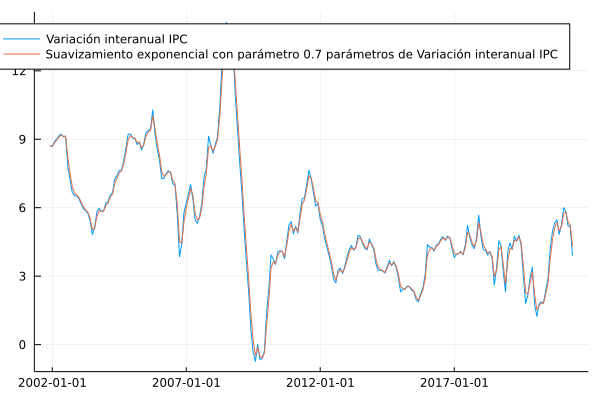

# Suavizamiento exponencial 

En esta sección se documentan los resultados del proceso de evaluación de las medidas basadas en el suavizamiento exponencial de la variación interanual del IPC.

## Resultados de evaluación con criterios básicos a diciembre de 2019

| Medida      |    MSE | Error estándar |
| :---------- | -----: | -------------: |
Llenar acá...

## Descomposición aditiva del MSE

| Medida                       |    MSE | Comp. Sesgo | Comp. Varianza | Comp. Covarianza |
| :--------------------------- | -----: | ----------: | -------------: | ---------------: |
Llenar acá...

## Métricas de evaluación 

| Medida                       |   RMSE | Error medio |    MAE |  Huber | Correlación |
| :--------------------------- | -----: | ----------: | -----: | -----: | ----------: |
Llenar acá...

## Trayectorias de inflación observada

