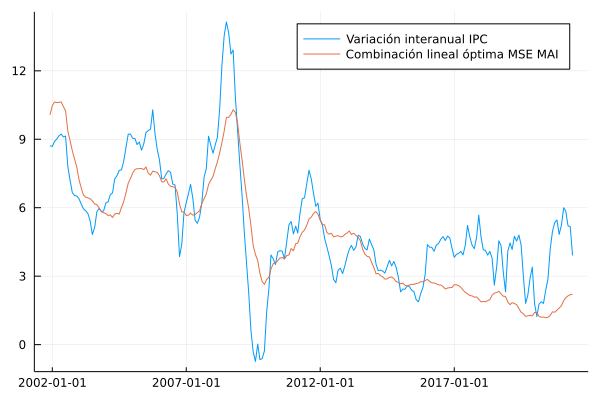

# Subyacente MAI 

En esta sección se documentan los resultados del proceso de evaluación de las medidas de inflación interanual basadas en la metodología de muestra ampliada implícitamente (MAI).

## Resultados de evaluación con criterios básicos a diciembre de 2020

### Evaluación de metodologías MAI-F

| Medida     |    MSE | Error estándar |
| :--------- | -----: | -------------: |
| MAI (F,3)  | 0.3255 |         0.0003 |
| MAI (F,4)  | 0.3877 |         0.0004 |
| MAI (F,5)  | 0.3065 |         0.0003 |
| MAI (F,8)  | 0.2666 |         0.0003 |
| MAI (F,10) | 0.3322 |         0.0003 |
| MAI (F,20) | 0.7388 |         0.0005 |
| MAI (F,40) | 1.0427 |         0.0006 |

### Evaluación de metodologías MAI-G

| Medida     |    MSE | Error estándar |
| :--------- | -----: | -------------: |
| MAI (G,3)  | 0.5772 |         0.0004 |
| MAI (G,4)  | 0.9982 |         0.0006 |
| MAI (G,5)  | 1.0588 |         0.0006 |
| MAI (G,8)  | 0.8817 |         0.0006 |
| MAI (G,10) | 0.8029 |         0.0006 |
| MAI (G,20) | 0.7229 |         0.0006 |
| MAI (G,40) | 0.8389 |         0.0007 |

### Evaluación de metodologías MAI-FP

| Medida      |    MSE | Error estándar |
| :---------- | -----: | -------------: |
| MAI (FP,3)  |   0.26 |         0.0002 |
| MAI (FP,4)  | 0.3404 |         0.0002 |
| MAI (FP,5)  | 0.2758 |         0.0002 |
| MAI (FP,8)  | 0.3188 |         0.0003 |
| MAI (FP,10) | 0.3979 |         0.0003 |
| MAI (FP,20) | 0.8284 |         0.0005 |
| MAI (FP,40) | 1.1963 |         0.0007 |

### Combinación lineal óptima 

| Medida     | Ponderador |
| ---------- | ---------: |
| MAI (F,4)  |     0.7273 |
| MAI (F,5)  |    -0.2012 |
| MAI (F,10) |     0.2112 |
| MAI (F,20) |    -0.0737 |
| MAI (F,40) |     0.2145 |
| MAI (G,4)  |       0.11 |
| MAI (G,5)  |    -0.0527 |
| MAI (G,10) |    -0.0198 |
| MAI (G,20) |     0.0425 |
| MAI (G,40) |     0.0178 |

| Medida          |    MSE | Error estándar |
| :-------------- | -----: | -------------: |
| Combinación MAI | 0.2125 |         0.0002 |

## Descomposición aditiva del MSE

### Metodologías MAI-F
| Medida     |    MSE | Comp. Sesgo | Comp. Varianza | Comp. Covarianza |
| :--------- | -----: | ----------: | -------------: | ---------------: |
| MAI (F,3)  | 0.3255 |      0.0953 |         0.0202 |           0.2101 |
| MAI (F,4)  | 0.3877 |      0.1035 |         0.0454 |           0.2388 |
| MAI (F,5)  | 0.3065 |      0.0677 |         0.0113 |           0.2276 |
| MAI (F,8)  | 0.2666 |      0.0456 |         0.0347 |           0.1863 |
| MAI (F,10) | 0.3322 |      0.0509 |         0.0759 |           0.2054 |
| MAI (F,20) | 0.7388 |      0.0445 |         0.2777 |           0.4165 |
| MAI (F,40) | 1.0427 |      0.0431 |         0.3626 |            0.637 |

### Metodologías MAI-FP
| Medida      |    MSE | Comp. Sesgo | Comp. Varianza | Comp. Covarianza |
| :---------- | -----: | ----------: | -------------: | ---------------: |
| MAI (FP,3)  |   0.26 |      0.0387 |         0.0072 |           0.2141 |
| MAI (FP,4)  | 0.3404 |      0.0437 |          0.055 |           0.2417 |
| MAI (FP,5)  | 0.2758 |      0.0228 |         0.0172 |           0.2358 |
| MAI (FP,8)  | 0.3188 |      0.0789 |         0.0573 |           0.1826 |
| MAI (FP,10) | 0.3979 |      0.0799 |         0.1188 |           0.1992 |
| MAI (FP,20) | 0.8284 |      0.0473 |         0.4044 |           0.3767 |
| MAI (FP,40) | 1.1963 |      0.0457 |         0.5382 |           0.6125 |

### Metodologías MAI-G

| Medida     |    MSE | Comp. Sesgo | Comp. Varianza | Comp. Covarianza |
| :--------- | -----: | ----------: | -------------: | ---------------: |
| MAI (G,3)  | 0.5772 |      0.0479 |         0.1148 |           0.4146 |
| MAI (G,4)  | 0.9982 |      0.0608 |         0.4838 |           0.4536 |
| MAI (G,5)  | 1.0588 |      0.0414 |         0.5164 |            0.501 |
| MAI (G,8)  | 0.8817 |      0.0789 |         0.3214 |           0.4814 |
| MAI (G,10) | 0.8029 |      0.1005 |         0.2175 |           0.4849 |
| MAI (G,20) | 0.7229 |      0.1069 |          0.078 |            0.538 |
| MAI (G,40) | 0.8389 |      0.0977 |         0.1046 |           0.6366 |

### Combinación lineal óptima 

| Medida          |    MSE | Comp. Sesgo | Comp. Varianza | Comp. Covarianza |
| :-------------- | -----: | ----------: | -------------: | ---------------: |
| Combinación MAI | 0.2125 |      0.0378 |         0.0094 |           0.1653 |

## Métricas de evaluación 

### Metodologías MAI-F
| Medida     |   RMSE | Error medio |    MAE |  Huber | Correlación |
| :--------- | -----: | ----------: | -----: | -----: | ----------: |
| MAI (F,3)  | 0.5627 |      0.2294 | 0.4661 | 0.1605 |       0.982 |
| MAI (F,4)  | 0.6132 |      0.2516 | 0.4873 | 0.1881 |       0.982 |
| MAI (F,5)  | 0.5458 |      0.1668 | 0.4351 | 0.1502 |       0.982 |
| MAI (F,8)  | 0.5091 |      -0.086 | 0.3899 | 0.1284 |      0.9838 |
| MAI (F,10) | 0.5687 |     -0.1071 | 0.4396 | 0.1579 |      0.9814 |
| MAI (F,20) | 0.8536 |     -0.0335 | 0.7125 | 0.3386 |      0.9572 |
| MAI (F,40) | 1.0157 |     -0.0154 | 0.8704 | 0.4625 |       0.932 |

### Metodologías MAI-G
| Medida     |   RMSE | Error medio |    MAE |  Huber | Correlación |
| :--------- | -----: | ----------: | -----: | -----: | ----------: |
| MAI (G,3)  | 0.7536 |       0.078 | 0.6138 | 0.2702 |      0.9701 |
| MAI (G,4)  | 0.9927 |      0.1452 | 0.8486 | 0.4437 |      0.9711 |
| MAI (G,5)  | 1.0235 |      -0.045 | 0.8917 | 0.4747 |      0.9682 |
| MAI (G,8)  | 0.9322 |     -0.1939 | 0.7843 | 0.3978 |      0.9678 |
| MAI (G,10) | 0.8885 |     -0.2414 | 0.7337 | 0.3621 |      0.9664 |
| MAI (G,20) |  0.842 |       -0.25 | 0.6782 | 0.3244 |      0.9595 |
| MAI (G,40) | 0.9073 |     -0.2223 | 0.7291 | 0.3669 |      0.9528 |

### Metodologías MAI-FP
| Medida      |   RMSE | Error medio |    MAE |  Huber | Correlación |
| :---------- | -----: | ----------: | -----: | -----: | ----------: |
| MAI (FP,3)  | 0.5064 |      0.1477 | 0.4071 | 0.1289 |      0.9821 |
| MAI (FP,4)  | 0.5792 |       0.165 | 0.4614 | 0.1673 |       0.982 |
| MAI (FP,5)  | 0.5211 |      0.0799 | 0.4132 |  0.136 |      0.9816 |
| MAI (FP,8)  | 0.5576 |     -0.2518 | 0.4141 | 0.1506 |      0.9837 |
| MAI (FP,10) | 0.6237 |      -0.252 | 0.4709 |  0.185 |      0.9813 |
| MAI (FP,20) | 0.9045 |     -0.1686 | 0.7596 | 0.3731 |       0.959 |
| MAI (FP,40) | 1.0886 |     -0.1645 | 0.9478 | 0.5222 |      0.9296 |

### Combinación MAI  

| Medida          |   RMSE | Error medio |    MAE |  Huber | Correlación |
| :-------------- | -----: | ----------: | -----: | -----: | ----------: |
| Combinación MAI | 0.4551 |      0.0031 | 0.3546 | 0.1044 |      0.9862 |

## Trayectoria de inflación observada

## Optimización de cuantiles 

Resultados del proceso de optimización de cuantiles utilizando $n \in \lbrace 3,4,5,10 \rbrace$. 

| Medida                                                                |    MSE | Error estándar |
| :-------------------------------------------------------------------- | -----: | -------------: |
| MAI (FP,4,[0.27, 0.72, 0.77])                                         | 0.2122 |         0.0001 |
| MAI (F,4,[0.22, 0.64, 0.86])                                          | 0.2254 |         0.0002 |
| MAI (G,10,[0.06, 0.27, 0.36, 0.67, 0.67, 0.68, 0.7194, 0.7247, 0.73]) | 0.4778 |         0.0004 |
| Combinación MAI                                                       | 0.2007 |         0.0001 |
### Ponderadores de combinación lineal 

| Medida                                                                | Ponderador |
| :-------------------------------------------------------------------- | ---------: |
| MAI (FP,4,[0.27, 0.72, 0.77])                                         |     0.6246 |
| MAI (F,4,[0.22, 0.64, 0.86])                                          |     0.4134 |
| MAI (G,10,[0.06, 0.27, 0.36, 0.67, 0.67, 0.68, 0.7194, 0.7247, 0.73]) |    -0.0302 |

### Descomposición aditiva del MSE

| Medida                                                                |    MSE | Comp. Sesgo | Comp. Varianza | Comp. Covarianza |
| :-------------------------------------------------------------------- | -----: | ----------: | -------------: | ---------------: |
| MAI (FP,4,[0.27, 0.72, 0.77])                                         | 0.2122 |      0.0215 |         0.0038 |           0.1869 |
| MAI (F,4,[0.22, 0.64, 0.86])                                          | 0.2254 |      0.0422 |         0.0073 |           0.1759 |
| MAI (G,10,[0.06, 0.27, 0.36, 0.67, 0.67, 0.68, 0.7194, 0.7247, 0.73]) | 0.4778 |      0.0429 |         0.0186 |           0.4163 |
| Combinación MAI                                                       | 0.2007 |      0.0207 |         0.0043 |           0.1757 |

### Métricas de evaluación 

| Medida                                                                |   RMSE | Error medio |    MAE |  Huber | Correlación |
| :-------------------------------------------------------------------- | -----: | ----------: | -----: | -----: | ----------: |
| MAI (F,4,[0.22, 0.64, 0.86])                                          | 0.4686 |     -0.0601 | 0.3633 | 0.1103 |      0.9855 |
| MAI (FP,4,[0.27, 0.72, 0.77])                                         | 0.4572 |     -0.0722 | 0.3599 | 0.1049 |      0.9849 |
| MAI (G,10,[0.06, 0.27, 0.36, 0.67, 0.67, 0.68, 0.7194, 0.7247, 0.73]) | 0.6836 |     -0.0281 | 0.5392 | 0.2226 |      0.9658 |
| Combinación MAI                                                       | 0.4445 |     -0.0261 | 0.3489 | 0.0993 |      0.9858 |

### Trayectoria de inflación observada

