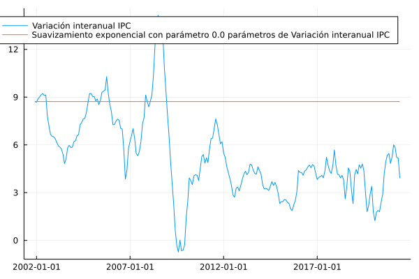

# Suavizamiento exponencial 

En esta sección se documentan los resultados del proceso de evaluación de las medidas basadas en el suavizamiento exponencial de la variación interanual del IPC.

## Resultados de evaluación con criterios básicos a diciembre de 2020

| Medida      |    MSE | Error estándar |
| :---------- | -----: | -------------: |
| Suavizamiento exponencial (0.0) |  7.0558 | 1.3675

## Descomposición aditiva del MSE

| Medida                       |    MSE | Comp. Sesgo | Comp. Varianza | Comp. Covarianza |
| :--------------------------- | -----: | ----------: | -------------: | ---------------: |
| Suavizamiento exponencial (0.0) | 7.0558 |0.9030  |  6.1528 |  -- |

## Métricas de evaluación 

| Medida                       |   RMSE | Error medio |    MAE |  Huber | Correlación |
| :--------------------------- | -----: | ----------: | -----: | -----: | ----------: |
| Suavizamiento exponencial (0.0) | 2.6474 | -0.4697 |  2.2279 | 1.7589  | --  |

## Trayectorias de inflación observada

