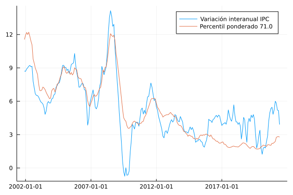
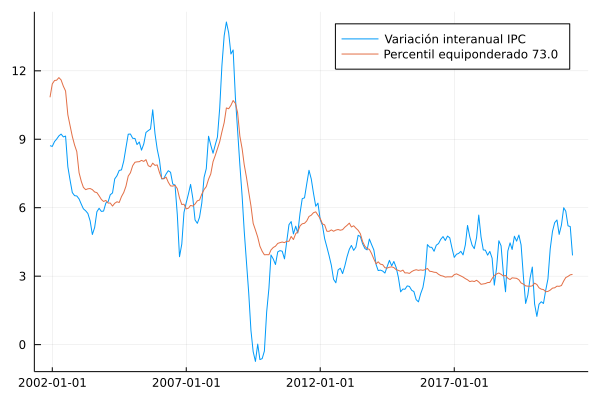

# Percentiles 

En esta sección se documentan los resultados del proceso de evaluación de las medidas de inflación interanual basadas en la metodología de percentiles ponderados y equiponderados.

## Resultados de evaluación con criterios básicos a diciembre de 2019

### Percentiles ponderados y equiponderados

| Medida                        |    MSE | Error estándar |
|:----------------------------- | ------:| --------------:|
| Percentil ponderado 71.0      | 0.5478 |         0.0004 |
| Percentil equiponderado 73.0  | 0.3322 |         0.0002 |

## Descomposición aditiva del MSE

### Percentiles ponderados y equiponderados

| Medida                       |    MSE | Comp. Sesgo | Comp. Varianza | Comp. Covarianza |
|:---------------------------- | ------:| -----------:| --------------:| ----------------:|
| Percentil ponderado 71.0     | 0.5478 |      0.0154 |         0.0552 |           0.4772 |
| Percentil equiponderado 73.0 | 0.3322 |      0.0033 |         0.0437 |           0.2852 |

## Métricas de evaluación 

### Percentiles ponderados y equiponderados

| Medida                       |   RMSE | Error medio |    MAE |  Huber | Correlación |
|:---------------------------- | ------:| -----------:| ------:| ------:| -----------:|
| Percentil ponderado 71.0     | 0.7340 |     -0.0663 | 0.5927 | 0.2532 |      0.9658 |
| Percentil equiponderado 73.0 | 0.5734 |      0.0028 | 0.4210 | 0.1551 |      0.9761 |

## Trayectoria de inflación observada

### Percentiles ponderados 

### Percentiles equiponderados

## Evaluación gráfica de percentiles 

### Percentiles ponderados 

### Percentiles equiponderados

## Resultados de evaluación con criterios básicos a diciembre de 2020

### Percentiles ponderados y equiponderados

| Medida                        |    MSE | Error estándar |
|:----------------------------- | ------:| --------------:|
| Percentil ponderado 71.0      | 0.5710 |         0.0004 |
| Percentil equiponderado 73.0  | 0.3142 |         0.0002 |

## Descomposición aditiva del MSE

### Percentiles ponderados y equiponderados

| Medida                       |    MSE | Comp. Sesgo | Comp. Varianza | Comp. Covarianza |
|:---------------------------- | ------:| -----------:| --------------:| ----------------:|
| Percentil ponderado 71.0     | 0.5710 |      0.0248 |         0.0742 |           0.4720 |
| Percentil equiponderado 73.0 | 0.3142 |      0.0045 |         0.0268 |           0.2829 |

## Métricas de evaluación 

### Percentiles ponderados y equiponderados

| Medida                       |   RMSE | Error medio |    MAE |  Huber | Correlación |
|:---------------------------- | ------:| -----------:| ------:| ------:| -----------:|
| Percentil ponderado 71.0     | 0.7504 |     -0.1214 | 0.6158 | 0.2660 |      0.9665 |
| Percentil equiponderado 73.0 | 0.5576 |     -0.0380 | 0.4097 | 0.1477 |      0.9766 |

## Trayectoria de inflación observada

### Percentiles ponderados 

### Percentiles equiponderados

## Evaluación gráfica de percentiles 

### Percentiles ponderados 

### Percentiles equiponderados

