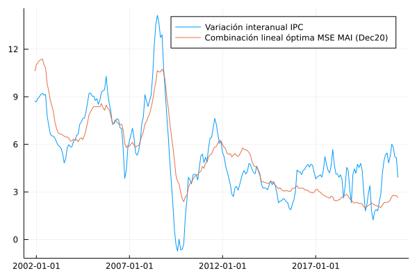

# Subyacente MAI 

En esta sección se documentan los resultados del proceso de evaluación de las medidas de inflación interanual basadas en la metodología de muestra ampliada implícitamente (MAI).

## Resultados de evaluación con criterios básicos a diciembre de 2019 modificando el parámetro de evaluación

### Evaluación de metodologías MAI-F

| Medida     |    MSE | Error estándar |
| :--------- | -----: | -------------: |
| MAI (F,3)  | 0.4303 |         0.0003 |
| MAI (F,4)  | 0.4029 |         0.0003 |
| MAI (F,5)  | 0.3911 |         0.0003 |
| MAI (F,8)  | 0.5241 |         0.0005 |
| MAI (F,10) | 0.6181 |         0.0006 |
| MAI (F,20) | 1.0431 |         0.0008 |
| MAI (F,40) | 1.3923 |         0.0009 |

### Evaluación de metodologías MAI-G

| Medida     |    MSE | Error estándar |
| :--------- | -----: | -------------: |
| MAI (G,3)  | 0.6555 |         0.0004 |
| MAI (G,4)  | 0.9531 |         0.0005 |
| MAI (G,5)  | 1.0549 |         0.0006 |
| MAI (G,8)  | 0.9985 |         0.0007 |
| MAI (G,10) | 0.9704 |         0.0007 |
| MAI (G,20) | 0.9572 |         0.0008 |
| MAI (G,40) |  1.037 |         0.0008 |

### Evaluación de metodologías MAI-FP

| Medida      |    MSE | Error estándar |
| :---------- | -----: | -------------: |
| MAI (FP,3)  | 0.3805 |         0.0002 |
| MAI (FP,4)  | 0.3929 |         0.0002 |
| MAI (FP,5)  |  0.393 |         0.0003 |
| MAI (FP,8)  |  0.667 |         0.0005 |
| MAI (FP,10) | 0.7839 |         0.0006 |
| MAI (FP,20) | 1.2305 |         0.0007 |
| MAI (FP,40) |   1.64 |         0.0009 |

### Combinación lineal óptima 

| Medida     | Ponderador |
| ---------- | ---------: |
| MAI (F,4)  |     0.7728 |
| MAI (F,5)  |    -0.2102 |
| MAI (F,10) |     0.2471 |
| MAI (F,20) |    -0.0654 |
| MAI (F,40) |     0.1582 |
| MAI (G,4)  |     0.0987 |
| MAI (G,5)  |    -0.0675 |
| MAI (G,10) |    -0.0344 |
| MAI (G,20) |     0.0652 |
| MAI (G,40) |     0.0491 |

| Medida          |    MSE | Error estándar |
| :-------------- | -----: | -------------: |
| Combinación MAI | 0.3373 |         0.0003 |

### Descomposición aditiva del MSE

#### Metodologías MAI-F
| Medida     |    MSE | Comp. Sesgo | Comp. Varianza | Comp. Covarianza |
| :--------- | -----: | ----------: | -------------: | ---------------: |
| MAI (F,3)  | 0.4303 |      0.0436 |         0.0741 |           0.3126 |
| MAI (F,4)  | 0.4029 |      0.0439 |         0.0083 |           0.3507 |
| MAI (F,5)  | 0.3911 |      0.0422 |          0.014 |           0.3349 |
| MAI (F,8)  | 0.5241 |      0.1315 |         0.1007 |           0.2919 |
| MAI (F,10) | 0.6181 |       0.146 |         0.1597 |           0.3123 |
| MAI (F,20) | 1.0431 |      0.1151 |          0.381 |           0.5469 |
| MAI (F,40) | 1.3923 |      0.1076 |          0.477 |           0.8077 |

#### Metodologías MAI-G
| Medida     |    MSE | Comp. Sesgo | Comp. Varianza | Comp. Covarianza |
| :--------- | -----: | ----------: | -------------: | ---------------: |
| MAI (G,3)  | 0.6555 |      0.0664 |         0.0458 |           0.5433 |
| MAI (G,4)  | 0.9531 |      0.0484 |         0.3081 |           0.5967 |
| MAI (G,5)  | 1.0549 |      0.1153 |         0.3069 |           0.6328 |
| MAI (G,8)  | 0.9985 |      0.2203 |         0.1748 |           0.6035 |
| MAI (G,10) | 0.9704 |       0.262 |         0.1102 |           0.5982 |
| MAI (G,20) | 0.9572 |      0.2798 |         0.0489 |           0.6285 |
| MAI (G,40) |  1.037 |      0.2507 |         0.0756 |           0.7107 |

#### Metodologías MAI-FP
| Medida      |    MSE | Comp. Sesgo | Comp. Varianza | Comp. Covarianza |
| :---------- | -----: | ----------: | -------------: | ---------------: |
| MAI (FP,3)  | 0.3805 |      0.0231 |         0.0353 |           0.3221 |
| MAI (FP,4)  | 0.3929 |      0.0201 |         0.0145 |           0.3583 |
| MAI (FP,5)  |  0.393 |      0.0409 |         0.0068 |           0.3453 |
| MAI (FP,8)  |  0.667 |      0.2454 |         0.1331 |           0.2885 |
| MAI (FP,10) | 0.7839 |      0.2554 |          0.222 |           0.3065 |
| MAI (FP,20) | 1.2305 |      0.1838 |         0.5418 |           0.5049 |
| MAI (FP,40) |   1.64 |      0.1797 |         0.6841 |           0.7761 |

#### Combinación lineal óptima 

| Medida          |    MSE | Comp. Sesgo | Comp. Varianza | Comp. Covarianza |
| :-------------- | -----: | ----------: | -------------: | ---------------: |
| Combinación MAI | 0.3373 |      0.0416 |         0.2832 |           0.0125 |

### Métricas de evaluación 

#### Metodologías MAI-F
| Medida     |   RMSE | Error medio |    MAE |  Huber | Correlación |
| :--------- | -----: | ----------: | -----: | -----: | ----------: |
| MAI (F,3)  | 0.6525 |      0.0096 | 0.4985 | 0.2018 |      0.9731 |
| MAI (F,4)  | 0.6306 |      0.0553 | 0.5036 | 0.1939 |      0.9735 |
| MAI (F,5)  | 0.6206 |     -0.0346 | 0.4792 | 0.1844 |      0.9733 |
| MAI (F,8)  | 0.7139 |      -0.303 | 0.5303 | 0.2312 |      0.9744 |
| MAI (F,10) | 0.7759 |     -0.3241 | 0.5872 | 0.2695 |      0.9716 |
| MAI (F,20) | 1.0133 |     -0.2642 | 0.8261 | 0.4435 |      0.9446 |
| MAI (F,40) |  1.173 |     -0.2508 | 0.9875 | 0.5762 |      0.9149 |

#### Metodologías MAI-G
| Medida     |   RMSE | Error medio |    MAE |  Huber | Correlación |
| :--------- | -----: | ----------: | -----: | -----: | ----------: |
| MAI (G,3)  |  0.804 |     -0.1532 | 0.6707 |  0.305 |      0.9609 |
| MAI (G,4)  | 0.9715 |      -0.085 | 0.8469 | 0.4354 |       0.962 |
| MAI (G,5)  | 1.0219 |     -0.2727 | 0.8912 | 0.4759 |      0.9596 |
| MAI (G,8)  | 0.9917 |     -0.4221 | 0.8345 |  0.442 |      0.9595 |
| MAI (G,10) | 0.9762 |      -0.467 | 0.8092 | 0.4252 |      0.9584 |
| MAI (G,20) |  0.968 |     -0.4844 |  0.785 | 0.4111 |      0.9536 |
| MAI (G,40) | 1.0079 |     -0.4492 |  0.816 | 0.4385 |      0.9487 |

#### Metodologías MAI-FP
| Medida      |   RMSE | Error medio |    MAE |  Huber | Correlación |
| :---------- | -----: | ----------: | -----: | -----: | ----------: |
| MAI (FP,5)  | 0.6228 |     -0.1517 | 0.4858 |  0.185 |       0.973 |
| MAI (FP,8)  | 0.8094 |     -0.4774 | 0.6018 | 0.2857 |      0.9741 |
| MAI (FP,3)  |  0.614 |     -0.0685 | 0.4603 | 0.1789 |      0.9733 |
| MAI (FP,4)  | 0.6241 |     -0.0462 | 0.5088 | 0.1899 |      0.9734 |
| MAI (FP,10) | 0.8783 |     -0.4874 | 0.6626 | 0.3299 |      0.9711 |
| MAI (FP,20) |  1.103 |     -0.4042 | 0.8972 | 0.5046 |      0.9454 |
| MAI (FP,40) |  1.275 |     -0.3995 | 1.0814 |  0.657 |      0.9116 |

#### Combinación MAI  

| Medida          |   RMSE | Error medio |   MAE |  Huber | Correlación |
| :-------------- | -----: | ----------: | ----: | -----: | ----------: |
| Combinación MAI | 0.5758 |     -0.0001 | 0.452 | 0.1615 |      0.9775 |

### Trayectoria de inflación observada

### Optimización de cuantiles 

Resultados del proceso de optimización de cuantiles utilizando $n \in \lbrace 3,4,5,10 \rbrace$. 

| Medida                                                                |    MSE | Error estándar |
| :-------------------------------------------------------------------- | -----: | -------------: |
| MAI (FP,4,[0.33, 0.62, 0.7])                                          | 0.3609 |         0.0002 |
| MAI (F,4,[0.31, 0.64, 0.75])                                          | 0.3688 |         0.0002 |
| MAI (G,10,[0.05, 0.25, 0.41, 0.45, 0.63, 0.68, 0.71, 0.7161, 0.7241]) | 0.6074 |         0.0005 |
| Combinación MAI                                                       | 0.3545 |         0.0002 |

#### Ponderadores de combinación lineal 

| Medida                                                                | Ponderador |
| :-------------------------------------------------------------------- | ---------: |
| MAI (FP,4,[0.33, 0.62, 0.7])                                          |      0.622 |
| MAI (F,4,[0.31, 0.64, 0.75])                                          |     0.3612 |
| MAI (G,10,[0.05, 0.25, 0.41, 0.45, 0.63, 0.68, 0.71, 0.7161, 0.7241]) |     0.0222 |

#### Descomposición aditiva del MSE

| Medida                                                                |    MSE | Comp. Sesgo | Comp. Varianza | Comp. Covarianza |
| :-------------------------------------------------------------------- | -----: | ----------: | -------------: | ---------------: |
| MAI (F,4,[0.31, 0.64, 0.75])                                          | 0.3688 |      0.0421 |         0.0068 |           0.3199 |
| MAI (FP,4,[0.33, 0.62, 0.7])                                          | 0.3609 |      0.0221 |         0.0051 |           0.3338 |
| MAI (G,10,[0.05, 0.25, 0.41, 0.45, 0.63, 0.68, 0.71, 0.7161, 0.7241]) | 0.6074 |      0.0494 |         0.0205 |           0.5374 |
| Combinación MAI                                                       | 0.3545 |      0.0223 |         0.0046 |           0.3276 |

#### Métricas de evaluación 

| Medida                                                                |   RMSE | Error medio |    MAE |  Huber | Correlación |
| :-------------------------------------------------------------------- | -----: | ----------: | -----: | -----: | ----------: |
| MAI (F,4,[0.31, 0.64, 0.75])                                          | 0.6033 |     -0.0374 | 0.4779 | 0.1766 |      0.9749 |
| MAI (FP,4,[0.33, 0.62, 0.7])                                          |  0.598 |     -0.0614 | 0.4693 | 0.1728 |      0.9739 |
| MAI (G,10,[0.05, 0.25, 0.41, 0.45, 0.63, 0.68, 0.71, 0.7161, 0.7241]) | 0.7709 |     -0.0733 | 0.6016 | 0.2728 |      0.9579 |
| Combinación MAI                                                       | 0.5926 |     -0.0217 | 0.4689 | 0.1707 |      0.9745 |

#### Trayectoria de inflación observada

## Resultados de evaluación con criterios básicos a diciembre de 2020 modificando el parámetro de evaluación

### Evaluación de metodologías MAI-F
| Medida     |    MSE | Error estándar |
| :--------- | -----: | -------------: |
| MAI (F,3)  | 0.4037 |         0.0002 |
| MAI (F,4)  | 0.4298 |         0.0003 |
| MAI (F,5)  | 0.3982 |         0.0003 |
| MAI (F,8)  | 0.4927 |         0.0005 |
| MAI (F,10) | 0.5716 |         0.0006 |
| MAI (F,20) | 0.9584 |         0.0007 |
| MAI (F,40) | 1.2612 |         0.0008 |

### Evaluación de metodologías MAI-G
| Medida     |    MSE | Error estándar |
| :--------- | -----: | -------------: |
| MAI (G,3)  | 0.6986 |         0.0004 |
| MAI (G,4)  | 1.0603 |         0.0006 |
| MAI (G,5)  | 1.2091 |         0.0006 |
| MAI (G,8)  |  1.111 |         0.0007 |
| MAI (G,10) | 1.0582 |         0.0007 |
| MAI (G,20) | 0.9917 |         0.0008 |
| MAI (G,40) | 1.0921 |         0.0009 |

### Evaluación de metodologías MAI-FP
| Medida      |    MSE | Error estándar |
| :---------- | -----: | -------------: |
| MAI (FP,3)  | 0.3718 |         0.0002 |
| MAI (FP,4)  | 0.4226 |         0.0002 |
| MAI (FP,5)  | 0.4075 |         0.0002 |
| MAI (FP,8)  | 0.6311 |         0.0005 |
| MAI (FP,10) | 0.7158 |         0.0005 |
| MAI (FP,20) | 1.1216 |         0.0007 |
| MAI (FP,40) | 1.4974 |         0.0008 |

### Combinación lineal óptima 
| Medida     | Ponderador |
| ---------- | ---------: |
| MAI (F,4)  |       0.75 |
| MAI (F,5)  |    -0.1715 |
| MAI (F,10) |     0.1931 |
| MAI (F,20) |    -0.0346 |
| MAI (F,40) |     0.2223 |
| MAI (G,4)  |     0.0893 |
| MAI (G,5)  |    -0.0743 |
| MAI (G,10) |    -0.0227 |
| MAI (G,20) |      0.056 |
| MAI (G,40) |     0.0089 |

| Medida          |    MSE | Error estándar |
| :-------------- | -----: | -------------: |
| Combinación MAI | 0.3295 |         0.0002 |

### Descomposición aditiva del MSE

#### Metodologías MAI-F
| Medida     |    MSE | Comp. Sesgo | Comp. Varianza | Comp. Covarianza |
| :--------- | -----: | ----------: | -------------: | ---------------: |
| MAI (F,3)  | 0.4037 |      0.0427 |         0.0375 |           0.3234 |
| MAI (F,4)  | 0.4298 |      0.0404 |          0.026 |           0.3634 |
| MAI (F,5)  | 0.3982 |      0.0452 |         0.0068 |           0.3462 |
| MAI (F,8)  | 0.4927 |      0.1446 |         0.0564 |           0.2917 |
| MAI (F,10) | 0.5716 |        0.16 |         0.1082 |           0.3034 |
| MAI (F,20) | 0.9584 |      0.1183 |         0.3389 |           0.5012 |
| MAI (F,40) | 1.2612 |      0.1082 |         0.4322 |           0.7208 |

#### Metodologías MAI-G
| Medida     |    MSE | Comp. Sesgo | Comp. Varianza | Comp. Covarianza |
| :--------- | -----: | ----------: | -------------: | ---------------: |
| MAI (G,3)  | 0.6986 |      0.0681 |         0.0815 |            0.549 |
| MAI (G,4)  | 1.0603 |      0.0488 |         0.4095 |            0.602 |
| MAI (G,5)  | 1.2091 |      0.1207 |         0.4397 |           0.6488 |
| MAI (G,8)  |  1.111 |      0.2297 |         0.2628 |           0.6184 |
| MAI (G,10) | 1.0582 |      0.2741 |         0.1713 |           0.6128 |
| MAI (G,20) | 0.9917 |      0.2847 |          0.057 |             0.65 |
| MAI (G,40) | 1.0921 |      0.2622 |         0.0788 |           0.7511 |

#### Metodologías MAI-FP
| Medida      |    MSE | Comp. Sesgo | Comp. Varianza | Comp. Covarianza |
| :---------- | -----: | ----------: | -------------: | ---------------: |
| MAI (FP,3)  | 0.3718 |      0.0255 |         0.0174 |           0.3289 |
| MAI (FP,4)  | 0.4226 |      0.0221 |         0.0327 |           0.3678 |
| MAI (FP,5)  | 0.4075 |      0.0421 |         0.0082 |           0.3572 |
| MAI (FP,8)  | 0.6311 |      0.2575 |         0.0861 |           0.2875 |
| MAI (FP,10) | 0.7158 |      0.2587 |         0.1596 |           0.2975 |
| MAI (FP,20) | 1.1216 |       0.186 |         0.4784 |           0.4573 |
| MAI (FP,40) | 1.4974 |      0.1824 |         0.6232 |           0.6919 |

#### Combinación lineal óptima 
| Medida          |    MSE | Comp. Sesgo | Comp. Varianza | Comp. Covarianza |
| :-------------- | -----: | ----------: | -------------: | ---------------: |
| Combinación MAI | 0.3295 |      0.0411 |         0.2783 |           0.0102 |

### Métricas de evaluación 

#### Metodologías MAI-F
| Medida     |   RMSE | Error medio |    MAE |  Huber | Correlación |
| :--------- | -----: | ----------: | -----: | -----: | ----------: |
| MAI (F,3)  | 0.6319 |     -0.0107 | 0.4852 | 0.1914 |      0.9729 |
| MAI (F,4)  |  0.652 |      0.0114 | 0.5303 | 0.2077 |      0.9733 |
| MAI (F,5)  | 0.6266 |     -0.0734 | 0.4961 | 0.1901 |      0.9732 |
| MAI (F,8)  | 0.6917 |     -0.3262 | 0.5232 | 0.2212 |      0.9752 |
| MAI (F,10) | 0.7453 |     -0.3473 | 0.5658 | 0.2518 |      0.9731 |
| MAI (F,20) | 0.9708 |     -0.2737 | 0.7782 | 0.4081 |      0.9497 |
| MAI (F,40) |  1.116 |     -0.2556 | 0.9225 | 0.5247 |      0.9248 |

#### Metodologías MAI-G
| Medida     |   RMSE | Error medio |    MAE |  Huber | Correlación |
| :--------- | -----: | ----------: | -----: | -----: | ----------: |
| MAI (G,3)  | 0.8309 |     -0.1622 | 0.7007 | 0.3257 |      0.9613 |
| MAI (G,4)  | 1.0253 |      -0.095 | 0.8987 | 0.4782 |      0.9625 |
| MAI (G,5)  |  1.095 |     -0.2852 | 0.9625 | 0.5361 |      0.9598 |
| MAI (G,8)  | 1.0473 |     -0.4341 |  0.888 | 0.4862 |      0.9596 |
| MAI (G,10) | 1.0207 |     -0.4816 | 0.8517 | 0.4602 |      0.9585 |
| MAI (G,20) | 0.9862 |     -0.4902 |  0.802 | 0.4251 |      0.9522 |
| MAI (G,40) | 1.0352 |     -0.4625 | 0.8386 |  0.458 |      0.9456 |

#### Metodologías MAI-FP
| Medida      |   RMSE | Error medio |    MAE |  Huber | Correlación |
| :---------- | -----: | ----------: | -----: | -----: | ----------: |
| MAI (FP,3)  | 0.6071 |     -0.0925 | 0.4628 | 0.1769 |      0.9732 |
| MAI (FP,4)  | 0.6478 |     -0.0751 | 0.5385 | 0.2056 |      0.9732 |
| MAI (FP,5)  | 0.6349 |     -0.1603 | 0.5114 | 0.1952 |      0.9728 |
| MAI (FP,8)  | 0.7877 |      -0.492 | 0.5956 | 0.2755 |      0.9748 |
| MAI (FP,10) | 0.8391 |     -0.4922 | 0.6342 | 0.3056 |      0.9727 |
| MAI (FP,20) | 1.0527 |     -0.4088 | 0.8374 | 0.4604 |      0.9513 |
| MAI (FP,40) |  1.218 |     -0.4047 | 1.0093 | 0.6008 |      0.9222 |

#### Combinación MAI  
| Medida          |   RMSE | Error medio |    MAE |  Huber | Correlación |
| :-------------- | -----: | ----------: | -----: | -----: | ----------: |
| Combinación MAI | 0.5692 |     -0.0064 | 0.4493 | 0.1584 |      0.9778 |

### Trayectoria de inflación observada

### Optimización de cuantiles 

Resultados del proceso de optimización de cuantiles utilizando $n \in \lbrace 3,4,5,10 \rbrace$. 

| Medida                                                            |    MSE | Error estándar |
| :---------------------------------------------------------------- | -----: | -------------: |
| MAI (FP,4,[0.27, 0.64, 0.68])                                     | 0.3643 |         0.0002 |
| MAI (F,4,[0.27, 0.67, 0.72])                                      |  0.372 |         0.0002 |
| MAI (G,10,[0.06, 0.29, 0.34, 0.48, 0.52, 0.65, 0.66, 0.67, 0.69]) | 0.6051 |         0.0005 |
| Combinación MAI                                                   | 0.3565 |         0.0002 |

#### Ponderadores de combinación lineal 
| Medida                                                            | Ponderador |
| :---------------------------------------------------------------- | ---------: |
| MAI (FP,4,[0.27, 0.64, 0.68])                                     |     0.6676 |
| MAI (F,4,[0.27, 0.67, 0.72])                                      |     0.3397 |
| MAI (G,10,[0.06, 0.29, 0.34, 0.48, 0.52, 0.65, 0.66, 0.67, 0.69]) |     0.0015 |

#### Descomposición aditiva del MSE
| Medida                                                            |    MSE | Comp. Sesgo | Comp. Varianza | Comp. Covarianza |
| :---------------------------------------------------------------- | -----: | ----------: | -------------: | ---------------: |
| MAI (F,4,[0.27, 0.67, 0.72])                                      |  0.372 |      0.0435 |         0.0083 |           0.3203 |
| MAI (FP,4,[0.27, 0.64, 0.68])                                     | 0.3643 |      0.0224 |         0.0069 |            0.335 |
| MAI (G,10,[0.06, 0.29, 0.34, 0.48, 0.52, 0.65, 0.66, 0.67, 0.69]) | 0.6051 |       0.045 |         0.0197 |           0.5404 |
| Combinación MAI                                                   | 0.3565 |      0.0207 |          0.005 |           0.3307 |

#### Métricas de evaluación 
| Medida                                                            |   RMSE | Error medio |    MAE |  Huber | Correlación |
| :---------------------------------------------------------------- | -----: | ----------: | -----: | -----: | ----------: |
| MAI (F,4,[0.27, 0.67, 0.72])                                      | 0.6061 |      -0.051 | 0.4781 | 0.1785 |      0.9745 |
| MAI (FP,4,[0.27, 0.64, 0.68])                                     | 0.6011 |     -0.0747 | 0.4671 |  0.175 |      0.9733 |
| MAI (G,10,[0.06, 0.29, 0.34, 0.48, 0.52, 0.65, 0.66, 0.67, 0.69]) |   0.77 |     -0.0436 | 0.5989 | 0.2719 |      0.9573 |
| Combinación MAI                                                   | 0.5946 |     -0.0166 |  0.468 | 0.1726 |      0.9739 |

#### Trayectoria de inflación observada

