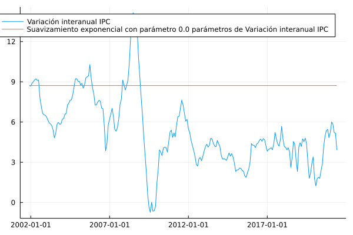

# Suavizamiento exponencial 

En esta sección se documentan los resultados del proceso de evaluación de las medidas basadas en el suavizamiento exponencial de la variación interanual del IPC.

## Resultados de evaluación con criterios básicos a diciembre de 2019

| Medida      |    MSE | Error estándar |
| :---------- | -----: | -------------: |
| Suavizamiento exponencial (0.0) |  7.8747 | 1.5706

## Descomposición aditiva del MSE

| Medida                       |    MSE | Comp. Sesgo | Comp. Varianza | Comp. Covarianza |
| :--------------------------- | -----: | ----------: | -------------: | ---------------: |
| Suavizamiento exponencial (0.0) | 7.8747 |1.3923 |  6.4824|  -- |

## Métricas de evaluación 

| Medida                       |   RMSE | Error medio |    MAE |  Huber | Correlación |
| :--------------------------- | -----: | ----------: | -----: | -----: | ----------: |
| Suavizamiento exponencial (0.0) | 2.7947 | -0.8425  | 2.3026   |  1.8361 | --  |

## Trayectorias de inflación observada

## Resultados de evaluación con criterios básicos a diciembre de 2019

| Medida      |    MSE | Error estándar |
| :---------- | -----: | -------------: |
| Suavizamiento exponencial (0.0) |  7.6225 | 1.4723 |

## Descomposición aditiva del MSE

| Medida                       |    MSE | Comp. Sesgo | Comp. Varianza | Comp. Covarianza |
| :--------------------------- | -----: | ----------: | -------------: | ---------------: |
| Suavizamiento exponencial (0.0) | 7.6225 |1.1863 | 6.4362 |  -- |

## Métricas de evaluación 

| Medida                       |   RMSE | Error medio |    MAE |  Huber | Correlación |
| :--------------------------- | -----: | ----------: | -----: | -----: | ----------: |
| Suavizamiento exponencial (0.0) | 2.7508 |  -0.7098 |  2.2618  | 1.7958  | --  |

## Trayectorias de inflación observada

