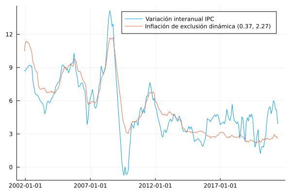

# Exclusión dinámica

En esta sección se documentan los resultados del proceso de evaluación de las medidas de inflación interanual basadas en la metodología de exclusión dinámica.

## Resultados de evaluación con criterios básicos a diciembre de 2019 modificando el parámetro de evaluación

### Exclusión dinámica con factores (0.3683, 2.2156)

| Medida                |    MSE | Error estándar |
|:--------------------- | ------:| --------------:|
| dynEx(0.3683, 2.2156) | 0.4033 |         0.0003 |

## Descomposición aditiva del MSE

### Exclusión dinámica con factores (0.3683, 2.2156)

| Medida                |    MSE | Comp. Sesgo | Comp. Varianza | Comp. Covarianza |
|:--------------------- | ------:| -----------:| --------------:| ----------------:|
| dynEx(0.3683, 2.2156) | 0.4033 |      0.0089 |         0.0144 |           0.3800 |

## Métricas de evaluación 

### Exclusión dinámica con factores (0.3683, 2.2156)
| Medida                |   RMSE | Error medio |    MAE |  Huber | Correlación |
|:--------------------- | ------:| -----------:| ------:| ------:| -----------:|
| dynEx(0.3683, 2.2156) | 0.6291 |     -0.0061 | 0.4792 | 0.1882 |      0.9700 |

## Trayectoria de inflación observada

## Resultados de evaluación con criterios básicos a diciembre de 2020 modificando el parámetro de evaluación

### Exclusión dinámica con factores (0.3722, 2.2744)

| Medida                |    MSE | Error estándar |
|:--------------------- | ------:| --------------:|
| dynEx(0.3722, 2.2744) | 0.4007 |         0.0003 |

## Descomposición aditiva del MSE

### Exclusión dinámica con factores (0.3722, 2.2744)

| Medida                |    MSE | Comp. Sesgo | Comp. Varianza | Comp. Covarianza |
|:--------------------- | ------:| -----------:| --------------:| ----------------:|
| dynEx(0.3722, 2.2744) | 0.4007 |      0.0088 |         0.0113 |           0.3805 |

## Métricas de evaluación 

### Exclusión dinámica con factores (0.3722, 2.2744)
| Medida                |   RMSE | Error medio |    MAE |  Huber | Correlación |
|:--------------------- | ------:| -----------:| ------:| ------:| -----------:|
| dynEx(0.3722, 2.2744) | 0.6275 |     -0.0243 | 0.4854 | 0.1889 |      0.9704 |

## Trayectoria de inflación observada

