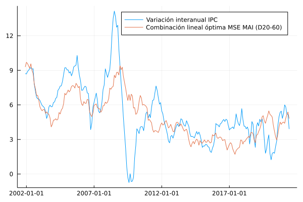

# Subyacente MAI 

En esta sección se documentan los resultados del proceso de evaluación de las medidas de inflación interanual basadas en la metodología de muestra ampliada implícitamente (MAI).

## Resultados de evaluación con criterios básicos a diciembre de 2019 modificando la metodología de remuestreo

### Evaluación de metodologías MAI-F, MAI-G, MAI-FP

| Medida      |    MSE | Error estándar |
| :---------- | -----: | -------------: |
| MAI (F,3)   | 2.8525 |         0.0023 |
| MAI (F,4)   | 3.7446 |         0.0031 |
| MAI (F,5)   | 4.4477 |         0.0039 |
| MAI (F,8)   | 4.3514 |          0.004 |
| MAI (F,10)  | 4.5483 |         0.0045 |
| MAI (F,20)  | 4.4021 |         0.0048 |
| MAI (F,40)  | 4.5285 |         0.0051 |
| MAI (FP,3)  | 2.9964 |         0.0025 |
| MAI (FP,4)  | 3.7756 |         0.0033 |
| MAI (FP,5)  | 4.5874 |          0.004 |
| MAI (FP,8)  | 4.2057 |          0.004 |
| MAI (FP,10) |  4.348 |         0.0045 |
| MAI (FP,20) |  4.162 |         0.0046 |
| MAI (FP,40) |  4.398 |          0.005 |
| MAI (G,4)   | 5.1329 |         0.0041 |
| MAI (G,5)   | 6.5575 |         0.0058 |
| MAI (G,8)   | 6.4145 |         0.0057 |
| MAI (G,10)  | 6.4571 |         0.0058 |
| MAI (G,20)  | 5.6442 |         0.0064 |
| MAI (G,40)  | 5.3194 |         0.0057 |

### Combinación lineal óptima 

| Medida     | Ponderador |
| ---------- | ---------: |
| MAI (F,4)  |     0.0801 |
| MAI (F,5)  |     0.9231 |
| MAI (F,10) |    -0.5952 |
| MAI (F,20) |     0.0047 |
| MAI (F,40) |     0.3838 |
| MAI (G,4)  |      2.199 |
| MAI (G,5)  |    -2.6646 |
| MAI (G,10) |    -0.0572 |
| MAI (G,20) |    -0.0695 |
| MAI (G,40) |     0.6903 |

| Medida          |    MSE | Error estándar |
| :-------------- | -----: | -------------: |
| Combinación MAI | 1.3934 |         0.0017 |

### Descomposición aditiva del MSE

#### Metodologías MAI-F, MAI-G, MAI-FP
| Medida      |    MSE | Comp. Sesgo | Comp. Varianza | Comp. Covarianza |
| :---------- | -----: | ----------: | -------------: | ---------------: |
| MAI (F,3)   | 2.8525 |       0.191 |         0.1725 |            2.489 |
| MAI (F,4)   | 3.7446 |      0.2624 |          0.512 |           2.9702 |
| MAI (F,5)   | 4.4477 |      0.1551 |          0.576 |           3.7165 |
| MAI (F,8)   | 4.3514 |      0.1458 |         0.3735 |            3.832 |
| MAI (F,10)  | 4.5483 |      0.1441 |         0.3417 |           4.0625 |
| MAI (F,20)  | 4.4021 |      0.1348 |         0.1261 |           4.1411 |
| MAI (F,40)  | 4.5285 |      0.1446 |         0.0944 |           4.2894 |
| MAI (FP,3)  | 2.9964 |      0.1489 |         0.2648 |           2.5827 |
| MAI (FP,4)  | 3.7756 |      0.1752 |         0.5961 |           3.0044 |
| MAI (FP,5)  | 4.5874 |      0.1384 |         0.6707 |           3.7783 |
| MAI (FP,8)  | 4.2057 |      0.1444 |         0.2985 |           3.7629 |
| MAI (FP,10) |  4.348 |      0.1172 |         0.2567 |           3.9742 |
| MAI (FP,20) |  4.162 |      0.1056 |         0.0882 |           3.9683 |
| MAI (FP,40) |  4.398 |      0.1514 |          0.093 |           4.1536 |
| MAI (G,3)   | 4.0506 |       0.146 |         0.7689 |           3.1357 |
| MAI (G,4)   | 5.1329 |      0.1687 |         1.4914 |           3.4728 |
| MAI (G,5)   | 6.5575 |      0.1642 |           1.76 |           4.6333 |
| MAI (G,8)   | 6.4145 |      0.1693 |         1.6712 |            4.574 |
| MAI (G,10)  | 6.4571 |      0.1981 |         1.5066 |           4.7523 |
| MAI (G,20)  | 5.6442 |      0.1967 |         1.1313 |           4.3161 |
| MAI (G,40)  | 5.3194 |      0.2413 |         0.9456 |           4.1325 |

#### Combinación lineal óptima 

| Medida          |    MSE | Comp. Sesgo | Comp. Varianza | Comp. Covarianza |
| :-------------- | -----: | ----------: | -------------: | ---------------: |
| Combinación MAI | 1.3934 |      0.1107 |         1.2384 |           0.0443 |

### Métricas de evaluación 

#### Metodologías MAI-F, MAI-G, MAI-FP
| Medida      |   RMSE | Error medio |    MAE |  Huber | Correlación |
| :---------- | -----: | ----------: | -----: | -----: | ----------: |
| MAI (F,3)   | 1.6703 |      0.2524 | 1.2736 | 0.8726 |      0.8213 |
| MAI (F,4)   | 1.9136 |      0.3252 | 1.4528 | 1.0345 |      0.8086 |
| MAI (F,5)   | 2.0825 |     -0.0078 | 1.5929 | 1.1745 |      0.7624 |
| MAI (F,8)   | 2.0567 |     -0.0139 |  1.572 | 1.1574 |      0.7406 |
| MAI (F,10)  | 2.0986 |      0.0273 | 1.5962 | 1.1808 |       0.722 |
| MAI (F,20)  | 2.0577 |      0.0148 | 1.5929 | 1.1571 |      0.6868 |
| MAI (F,40)  | 2.0848 |     -0.0603 | 1.6225 | 1.1778 |      0.6604 |
| MAI (FP,3)  |  1.711 |      0.2019 | 1.3081 | 0.9013 |      0.8214 |
| MAI (FP,4)  | 1.9191 |      0.2243 | 1.4702 | 1.0466 |      0.8099 |
| MAI (FP,5)  | 2.1153 |     -0.1083 | 1.6273 | 1.2046 |       0.763 |
| MAI (FP,8)  | 2.0198 |     -0.1977 | 1.5438 | 1.1313 |      0.7387 |
| MAI (FP,10) | 2.0491 |      -0.135 | 1.5565 | 1.1427 |      0.7191 |
| MAI (FP,20) | 1.9998 |     -0.1092 | 1.5572 |  1.118 |       0.683 |
| MAI (FP,40) | 2.0539 |      -0.213 | 1.6045 |  1.159 |      0.6501 |
| MAI (G,3)   | 1.9931 |      0.0823 | 1.6275 | 1.1822 |      0.8086 |
| MAI (G,4)   | 2.2424 |      0.1901 | 1.8264 | 1.3725 |      0.8081 |
| MAI (G,5)   | 2.5287 |     -0.0966 | 2.0295 | 1.5741 |      0.7511 |
| MAI (G,8)   | 2.5007 |     -0.1494 | 2.0012 | 1.5459 |      0.7518 |
| MAI (G,10)  | 2.5082 |      -0.211 | 2.0161 |   1.56 |      0.7365 |
| MAI (G,20)  |  2.327 |     -0.2066 | 1.8049 | 1.3548 |      0.7497 |
| MAI (G,40)  | 2.2639 |     -0.3048 |  1.748 | 1.3033 |      0.7531 |

#### Combinación MAI  

| Medida          |   RMSE | Error medio |    MAE |  Huber | Correlación |
| :-------------- | -----: | ----------: | -----: | -----: | ----------: |
| Combinación MAI | 1.1625 |     -0.1228 | 0.9252 | 0.5355 |      0.8978 |

### Trayectoria de inflación observada

### Optimización de cuantiles 

Resultados del proceso de optimización de cuantiles utilizando $n \in \lbrace 3,4,5,10 \rbrace$. 

| Medida |  MSE | Error estándar |
| :----- | ---: | -------------: |

#### Ponderadores de combinación lineal 

| Medida | Ponderador |
| :----- | ---------: |

#### Descomposición aditiva del MSE

| Medida |  MSE | Comp. Sesgo | Comp. Varianza | Comp. Covarianza |
| :----- | ---: | ----------: | -------------: | ---------------: |

#### Métricas de evaluación 

| Medida | RMSE | Error medio |  MAE | Huber | Correlación |
| :----- | ---: | ----------: | ---: | ----: | ----------: |

#### Trayectoria de inflación observada

## Resultados de evaluación con criterios básicos a diciembre de 2020 modificando la metodología de remuestreo

### Evaluación de metodologías MAI-F, MAI-G, MAI-FP

| Medida      |    MSE | Error estándar |
| :---------- | -----: | -------------: |
| MAI (F,3)   | 2.8808 |         0.0023 |
| MAI (F,4)   | 3.8064 |         0.0032 |
| MAI (F,5)   | 4.4228 |         0.0037 |
| MAI (F,8)   | 4.3484 |         0.0039 |
| MAI (F,10)  | 4.5144 |         0.0043 |
| MAI (F,20)  |  4.289 |         0.0046 |
| MAI (F,40)  | 4.3572 |         0.0048 |
| MAI (FP,3)  | 2.9876 |         0.0024 |
| MAI (FP,4)  | 3.8019 |         0.0033 |
| MAI (FP,5)  | 4.5221 |         0.0037 |
| MAI (FP,8)  | 4.1878 |         0.0038 |
| MAI (FP,10) |  4.288 |         0.0042 |
| MAI (FP,20) | 4.0387 |         0.0044 |
| MAI (FP,40) | 4.2338 |         0.0047 |
| MAI (G,3)   | 4.0578 |         0.0031 |
| MAI (G,4)   | 5.2252 |         0.0042 |
| MAI (G,5)   | 6.5528 |         0.0054 |
| MAI (G,8)   |  6.349 |         0.0053 |
| MAI (G,10)  | 6.4194 |         0.0054 |
| MAI (G,20)  | 5.8073 |         0.0061 |
| MAI (G,40)  | 5.4513 |         0.0055 |

### Combinación lineal óptima 

| Medida     | Ponderador |
| ---------- | ---------: |
| MAI (F,4)  |     0.5048 |
| MAI (F,5)  |     0.5693 |
| MAI (F,10) |    -0.8929 |
| MAI (F,20) |    -0.1465 |
| MAI (F,40) |     0.7731 |
| MAI (G,4)  |     1.8698 |
| MAI (G,5)  |    -2.1275 |
| MAI (G,10) |     0.2691 |
| MAI (G,20) |     -0.496 |
| MAI (G,40) |     0.5586 |

| Medida          |    MSE | Error estándar |
| :-------------- | -----: | -------------: |
| Combinación MAI | 1.5586 |          0.002 |

### Descomposición aditiva del MSE

#### Metodologías MAI-F, MAI-G, MAI-FP
| Medida      |    MSE | Comp. Sesgo | Comp. Varianza | Comp. Covarianza |
| :---------- | -----: | ----------: | -------------: | ---------------: |
| MAI (F,3)   | 2.8808 |       0.178 |         0.2355 |           2.4673 |
| MAI (F,4)   | 3.8064 |       0.254 |         0.6229 |           2.9295 |
| MAI (F,5)   | 4.4228 |      0.1671 |         0.6634 |           3.5923 |
| MAI (F,8)   | 4.3484 |      0.1448 |         0.4538 |           3.7498 |
| MAI (F,10)  | 4.5144 |       0.143 |         0.4078 |           3.9636 |
| MAI (F,20)  |  4.289 |      0.1372 |         0.1397 |           4.0121 |
| MAI (F,40)  | 4.3572 |      0.1416 |         0.0955 |             4.12 |
| MAI (FP,3)  | 2.9876 |      0.1441 |         0.3136 |           2.5299 |
| MAI (FP,4)  | 3.8019 |       0.184 |         0.6778 |             2.94 |
| MAI (FP,5)  | 4.5221 |      0.1687 |          0.728 |           3.6254 |
| MAI (FP,8)  | 4.1878 |      0.1652 |         0.3555 |           3.6671 |
| MAI (FP,10) |  4.288 |      0.1328 |          0.301 |           3.8543 |
| MAI (FP,20) | 4.0387 |      0.1175 |         0.0928 |           3.8284 |
| MAI (FP,40) | 4.2338 |      0.1572 |         0.0885 |           3.9881 |
| MAI (G,3)   | 4.0578 |      0.1347 |         0.8839 |           3.0392 |
| MAI (G,4)   | 5.2252 |      0.1833 |         1.6397 |           3.4022 |
| MAI (G,5)   | 6.5528 |      0.1804 |         1.9294 |            4.443 |
| MAI (G,8)   |  6.349 |      0.1903 |         1.7806 |           4.3781 |
| MAI (G,10)  | 6.4194 |      0.2131 |         1.6312 |           4.5751 |
| MAI (G,20)  | 5.8073 |      0.1932 |         1.1504 |           4.4637 |
| MAI (G,40)  | 5.4513 |      0.2396 |         0.9575 |           4.2542 |

#### Combinación lineal óptima 

| Medida          |    MSE | Comp. Sesgo | Comp. Varianza | Comp. Covarianza |
| :-------------- | -----: | ----------: | -------------: | ---------------: |
| Combinación MAI | 1.5586 |      0.1369 |         1.3686 |           0.0532 |

### Métricas de evaluación 

#### Metodologías MAI-F, MAI-G, MAI-FP
| Medida      |   RMSE | Error medio |    MAE |  Huber | Correlación |
| :---------- | -----: | ----------: | -----: | -----: | ----------: |
| MAI (F,3)   | 1.6789 |      0.2239 |  1.292 | 0.8866 |      0.8265 |
| MAI (F,4)   | 1.9294 |      0.2879 | 1.4721 | 1.0524 |      0.8144 |
| MAI (F,5)   | 2.0792 |     -0.0398 | 1.6091 | 1.1886 |      0.7728 |
| MAI (F,8)   | 2.0587 |      -0.045 | 1.5949 |  1.176 |      0.7492 |
| MAI (F,10)  | 2.0938 |      0.0063 | 1.6128 | 1.1921 |      0.7312 |
| MAI (F,20)  | 2.0335 |      0.0114 | 1.5826 | 1.1449 |      0.6961 |
| MAI (F,40)  | 2.0463 |     -0.0596 | 1.5913 |  1.147 |      0.6716 |
| MAI (FP,3)  | 1.7101 |      0.1651 | 1.3204 | 0.9106 |      0.8266 |
| MAI (FP,4)  | 1.9263 |      0.1693 | 1.4845 |  1.061 |      0.8156 |
| MAI (FP,5)  | 2.1034 |     -0.1517 | 1.6351 | 1.2126 |      0.7733 |
| MAI (FP,8)  | 2.0187 |     -0.2268 | 1.5645 | 1.1482 |      0.7475 |
| MAI (FP,10) | 2.0386 |     -0.1552 | 1.5708 | 1.1512 |      0.7292 |
| MAI (FP,20) | 1.9724 |     -0.1207 | 1.5445 | 1.1037 |      0.6941 |
| MAI (FP,40) | 2.0167 |     -0.2157 | 1.5766 | 1.1301 |      0.6625 |
| MAI (G,3)   | 1.9963 |      0.0553 | 1.6385 | 1.1913 |      0.8166 |
| MAI (G,4)   | 2.2634 |      0.1736 | 1.8507 | 1.3946 |      0.8137 |
| MAI (G,5)   | 2.5323 |     -0.1282 | 2.0504 | 1.5928 |      0.7632 |
| MAI (G,8)   | 2.4916 |     -0.1907 |   2.01 | 1.5527 |      0.7632 |
| MAI (G,10)  | 2.5049 |     -0.2379 | 2.0279 | 1.5708 |      0.7477 |
| MAI (G,20)  | 2.3666 |     -0.1625 | 1.8429 | 1.3927 |      0.7395 |
| MAI (G,40)  | 2.2966 |     -0.2919 | 1.7778 | 1.3326 |      0.7443 |

#### Combinación MAI  

| Medida          |   RMSE | Error medio |    MAE |  Huber | Correlación |
| :-------------- | -----: | ----------: | -----: | -----: | ----------: |
| Combinación MAI | 1.2265 |      -0.129 | 0.9737 | 0.5801 |      0.8852 |

### Trayectoria de inflación observada

### Optimización de cuantiles 

Resultados del proceso de optimización de cuantiles utilizando $n \in \lbrace 3,4,5,10 \rbrace$. 

| Medida |  MSE | Error estándar |
| :----- | ---: | -------------: |

#### Ponderadores de combinación lineal 

| Medida | Ponderador |
| :----- | ---------: |

#### Descomposición aditiva del MSE

| Medida |  MSE | Comp. Sesgo | Comp. Varianza | Comp. Covarianza |
| :----- | ---: | ----------: | -------------: | ---------------: |

#### Métricas de evaluación 

| Medida | RMSE | Error medio |  MAE | Huber | Correlación |
| :----- | ---: | ----------: | ---: | ----: | ----------: |

#### Trayectoria de inflación observada

## Resultados de evaluación con criterios básicos a diciembre de 2019 modificando la metodología de remuestreo y el parámetro de evaluación

### Evaluación de metodologías MAI-F, MAI-G, MAI-FP

| Medida      |    MSE | Error estándar |
| :---------- | -----: | -------------: |
| MAI (F,3)   | 2.9122 |         0.0025 |
| MAI (F,4)   | 3.7525 |         0.0033 |
| MAI (F,5)   | 4.6232 |         0.0043 |
| MAI (F,8)   | 4.5395 |         0.0044 |
| MAI (F,10)  | 4.7194 |         0.0049 |
| MAI (F,20)  | 4.5955 |         0.0052 |
| MAI (F,40)  | 4.7666 |         0.0056 |
| MAI (FP,3)  | 3.0745 |         0.0027 |
| MAI (FP,4)  | 3.8294 |         0.0035 |
| MAI (FP,5)  | 4.8103 |         0.0043 |
| MAI (FP,8)  | 4.4921 |         0.0044 |
| MAI (FP,10) | 4.6086 |         0.0048 |
| MAI (FP,20) | 4.4247 |          0.005 |
| MAI (FP,40) | 4.7216 |         0.0054 |
| MAI (G,3)   | 4.1691 |         0.0034 |
| MAI (G,4)   | 5.1794 |         0.0044 |
| MAI (G,5)   | 6.7456 |         0.0062 |
| MAI (G,8)   | 6.6281 |          0.006 |
| MAI (G,10)  | 6.7044 |         0.0062 |
| MAI (G,20)  | 5.8919 |         0.0068 |
| MAI (G,40)  | 5.6172 |          0.006 |

### Combinación lineal óptima 

| Medida     | Ponderador |
| ---------- | ---------: |
| MAI (F,4)  |     0.1729 |
| MAI (F,5)  |     0.8493 |
| MAI (F,10) |    -0.5753 |
| MAI (F,20) |      0.024 |
| MAI (F,40) |      0.398 |
| MAI (G,4)  |     2.1952 |
| MAI (G,5)  |    -2.7022 |
| MAI (G,10) |    -0.0639 |
| MAI (G,20) |    -0.0787 |
| MAI (G,40) |     0.7103 |

| Medida          |    MSE | Error estándar |
| :-------------- | -----: | -------------: |
| Combinación MAI | 1.5887 |         0.0019 |

### Descomposición aditiva del MSE

#### Metodologías MAI-F, MAI-G, MAI-FP
| Medida      |    MSE | Comp. Sesgo | Comp. Varianza | Comp. Covarianza |
| :---------- | -----: | ----------: | -------------: | ---------------: |
| MAI (F,3)   | 2.9122 |      0.1274 |         0.1399 |            2.645 |
| MAI (F,4)   | 3.7525 |      0.1633 |         0.4445 |           3.1448 |
| MAI (F,5)   | 4.6232 |      0.2184 |         0.5047 |           3.9001 |
| MAI (F,8)   | 4.5395 |      0.2121 |         0.3204 |           4.0069 |
| MAI (F,10)  | 4.7194 |      0.1902 |         0.2927 |           4.2365 |
| MAI (F,20)  | 4.5955 |      0.1871 |         0.1099 |           4.2985 |
| MAI (F,40)  | 4.7666 |      0.2335 |         0.0911 |            4.442 |
| MAI (FP,3)  | 3.0745 |      0.1099 |         0.2204 |           2.7442 |
| MAI (FP,4)  | 3.8294 |      0.1252 |         0.5224 |           3.1819 |
| MAI (FP,5)  | 4.8103 |      0.2507 |         0.5927 |           3.9669 |
| MAI (FP,8)  | 4.4921 |      0.3003 |         0.2536 |           3.9382 |
| MAI (FP,10) | 4.6086 |      0.2425 |         0.2181 |            4.148 |
| MAI (FP,20) | 4.4247 |      0.2183 |         0.0874 |            4.119 |
| MAI (FP,40) | 4.7216 |      0.3147 |         0.1066 |           4.3002 |
| MAI (G,3)   | 4.1691 |      0.1653 |         0.6812 |           3.3227 |
| MAI (G,4)   | 5.1794 |      0.1355 |         1.3665 |           3.6774 |
| MAI (G,5)   | 6.7456 |      0.2708 |         1.6239 |           4.8509 |
| MAI (G,8)   | 6.6281 |      0.3017 |          1.539 |           4.7874 |
| MAI (G,10)  | 6.7044 |      0.3605 |         1.3818 |            4.962 |
| MAI (G,20)  | 5.8919 |       0.357 |         1.0258 |            4.509 |
| MAI (G,40)  | 5.6172 |      0.4494 |         0.8512 |           4.3166 |

#### Combinación lineal óptima 

| Medida          |    MSE | Comp. Sesgo | Comp. Varianza | Comp. Covarianza |
| :-------------- | -----: | ----------: | -------------: | ---------------: |
| Combinación MAI | 1.5887 |      0.1223 |         1.4199 |           0.0466 |

### Métricas de evaluación 

#### Metodologías MAI-F, MAI-G, MAI-FP
| Medida      |   RMSE | Error medio |    MAE |  Huber | Correlación |
| :---------- | -----: | ----------: | -----: | -----: | ----------: |
| MAI (F,3)   |  1.686 |      0.0085 | 1.3119 | 0.8969 |      0.8141 |
| MAI (F,4)   | 1.9127 |      0.0813 | 1.4855 | 1.0545 |      0.8015 |
| MAI (F,5)   | 2.1209 |     -0.2517 | 1.6426 | 1.2128 |      0.7558 |
| MAI (F,8)   | 2.0985 |     -0.2578 | 1.6106 | 1.1879 |      0.7343 |
| MAI (F,10)  |  2.135 |     -0.2166 |  1.618 | 1.1998 |       0.716 |
| MAI (F,20)  |    2.1 |     -0.2291 | 1.5934 | 1.1651 |      0.6816 |
| MAI (F,40)  | 2.1358 |     -0.3042 | 1.6272 | 1.1892 |      0.6555 |
| MAI (FP,3)  |  1.732 |      -0.042 | 1.3523 | 0.9326 |      0.8142 |
| MAI (FP,4)  | 1.9305 |     -0.0196 | 1.5122 | 1.0775 |      0.8029 |
| MAI (FP,5)  | 2.1651 |     -0.3522 |  1.687 | 1.2521 |      0.7563 |
| MAI (FP,8)  | 2.0869 |     -0.4416 | 1.6023 | 1.1793 |      0.7322 |
| MAI (FP,10) | 2.1086 |     -0.3789 |  1.595 |  1.178 |      0.7128 |
| MAI (FP,20) | 2.0608 |     -0.3531 | 1.5675 | 1.1364 |      0.6777 |
| MAI (FP,40) | 2.1272 |     -0.4569 | 1.6234 | 1.1837 |       0.645 |
| MAI (G,3)   | 2.0202 |     -0.1616 | 1.6667 |  1.217 |      0.8014 |
| MAI (G,4)   | 2.2505 |     -0.0538 | 1.8529 | 1.3977 |      0.8011 |
| MAI (G,5)   | 2.5626 |     -0.3405 | 2.0667 |  1.611 |      0.7448 |
| MAI (G,8)   | 2.5407 |     -0.3933 | 2.0526 | 1.5968 |      0.7457 |
| MAI (G,10)  | 2.5538 |     -0.4549 | 2.0675 | 1.6107 |      0.7308 |
| MAI (G,20)  | 2.3757 |     -0.4505 | 1.8568 | 1.4038 |      0.7441 |
| MAI (G,40)  | 2.3262 |     -0.5487 | 1.8134 | 1.3664 |      0.7476 |

#### Combinación MAI  

| Medida          |  RMSE | Error medio |    MAE | Huber | Correlación |
| :-------------- | ----: | ----------: | -----: | ----: | ----------: |
| Combinación MAI | 1.242 |     -0.1381 | 0.9862 | 0.592 |      0.8881 |

### Trayectoria de inflación observada

### Optimización de cuantiles 

Resultados del proceso de optimización de cuantiles utilizando $n \in \lbrace 3,4,5,10 \rbrace$. 

| Medida |  MSE | Error estándar |
| :----- | ---: | -------------: |

#### Ponderadores de combinación lineal 

| Medida | Ponderador |
| :----- | ---------: |

#### Descomposición aditiva del MSE

| Medida |  MSE | Comp. Sesgo | Comp. Varianza | Comp. Covarianza |
| :----- | ---: | ----------: | -------------: | ---------------: |

#### Métricas de evaluación 

| Medida | RMSE | Error medio |  MAE | Huber | Correlación |
| :----- | ---: | ----------: | ---: | ----: | ----------: |

#### Trayectoria de inflación observada

## Resultados de evaluación con criterios básicos a diciembre de 2020 modificando la metodología de remuestreo y el parámetro de evaluación

### Evaluación de metodologías MAI-F, MAI-G, MAI-FP

| Medida      |    MSE | Error estándar |
| :---------- | -----: | -------------: |
| MAI (F,3)   | 2.9446 |         0.0025 |
| MAI (F,4)   | 3.8221 |         0.0034 |
| MAI (F,5)   | 4.6022 |          0.004 |
| MAI (F,8)   | 4.5411 |         0.0042 |
| MAI (F,10)  | 4.6859 |         0.0046 |
| MAI (F,20)  | 4.4759 |         0.0049 |
| MAI (F,40)  | 4.5865 |         0.0053 |
| MAI (FP,3)  | 3.0743 |         0.0026 |
| MAI (FP,4)  | 3.8726 |         0.0036 |
| MAI (FP,5)  | 4.7543 |          0.004 |
| MAI (FP,8)  | 4.4768 |         0.0042 |
| MAI (FP,10) | 4.5476 |         0.0045 |
| MAI (FP,20) | 4.2983 |         0.0047 |
| MAI (FP,40) | 4.5495 |         0.0051 |
| MAI (G,3)   | 4.1775 |         0.0033 |
| MAI (G,4)   | 5.2679 |         0.0044 |
| MAI (G,5)   | 6.7423 |         0.0057 |
| MAI (G,8)   | 6.5697 |         0.0056 |
| MAI (G,10)  | 6.6666 |         0.0058 |
| MAI (G,20)  | 6.0281 |         0.0065 |
| MAI (G,40)  | 5.7368 |         0.0058 |

### Combinación lineal óptima 

| Medida     | Ponderador |
| ---------- | ---------: |
| MAI (F,4)  |     0.5809 |
| MAI (F,5)  |     0.5147 |
| MAI (F,10) |    -0.8918 |
| MAI (F,20) |    -0.1193 |
| MAI (F,40) |     0.7911 |
| MAI (G,4)  |     1.8871 |
| MAI (G,5)  |    -2.1843 |
| MAI (G,10) |     0.2695 |
| MAI (G,20) |    -0.5059 |
| MAI (G,40) |     0.5754 |

| Medida          |    MSE | Error estándar |
| :-------------- | -----: | -------------: |
| Combinación MAI | 1.7544 |         0.0022 |

### Descomposición aditiva del MSE

#### Metodologías MAI-F, MAI-G, MAI-FP
| Medida      |    MSE | Comp. Sesgo | Comp. Varianza | Comp. Covarianza |
| :---------- | -----: | ----------: | -------------: | ---------------: |
| MAI (F,3)   | 2.9446 |      0.1282 |          0.192 |           2.6244 |
| MAI (F,4)   | 3.8221 |      0.1734 |         0.5436 |           3.1052 |
| MAI (F,5)   | 4.6022 |      0.2439 |         0.5819 |           3.7764 |
| MAI (F,8)   | 4.5411 |      0.2241 |         0.3907 |           3.9263 |
| MAI (F,10)  | 4.6859 |      0.1977 |         0.3499 |           4.1383 |
| MAI (F,20)  | 4.4759 |      0.1894 |         0.1195 |           4.1669 |
| MAI (F,40)  | 4.5865 |       0.228 |         0.0906 |           4.2679 |
| MAI (FP,3)  | 3.0743 |      0.1225 |         0.2613 |           2.6905 |
| MAI (FP,4)  | 3.8726 |      0.1604 |         0.5948 |           3.1174 |
| MAI (FP,5)  | 4.7543 |      0.2993 |          0.642 |           3.8131 |
| MAI (FP,8)  | 4.4768 |      0.3319 |         0.3022 |           3.8427 |
| MAI (FP,10) | 4.5476 |       0.265 |          0.255 |           4.0276 |
| MAI (FP,20) | 4.2983 |      0.2331 |         0.0886 |           3.9765 |
| MAI (FP,40) | 4.5495 |      0.3185 |         0.1005 |           4.1304 |
| MAI (G,3)   | 4.1775 |      0.1658 |         0.7849 |           3.2267 |
| MAI (G,4)   | 5.2679 |      0.1576 |         1.5026 |           3.6077 |
| MAI (G,5)   | 6.7423 |      0.2997 |         1.7801 |           4.6624 |
| MAI (G,8)   | 6.5697 |      0.3396 |         1.6376 |           4.5924 |
| MAI (G,10)  | 6.6666 |      0.3851 |         1.4951 |           4.7865 |
| MAI (G,20)  | 6.0281 |      0.3289 |          1.039 |           4.6602 |
| MAI (G,40)  | 5.7368 |      0.4375 |         0.8577 |           4.4416 |

#### Combinación lineal óptima 

| Medida          |    MSE | Comp. Sesgo | Comp. Varianza | Comp. Covarianza |
| :-------------- | -----: | ----------: | -------------: | ---------------: |
| Combinación MAI | 1.7544 |      0.1501 |          1.548 |           0.0563 |

### Métricas de evaluación 

#### Metodologías MAI-F, MAI-G, MAI-FP
| Medida      |   RMSE | Error medio |    MAE |  Huber | Correlación |
| :---------- | -----: | ----------: | -----: | -----: | ----------: |
| MAI (F,3)   | 1.6964 |     -0.0163 | 1.3332 | 0.9152 |      0.8195 |
| MAI (F,4)   | 1.9308 |      0.0477 | 1.5075 | 1.0758 |      0.8076 |
| MAI (F,5)   | 2.1195 |     -0.2799 | 1.6584 | 1.2283 |      0.7664 |
| MAI (F,8)   |  2.102 |     -0.2852 | 1.6331 | 1.2082 |      0.7432 |
| MAI (F,10)  |  2.131 |     -0.2339 | 1.6353 | 1.2132 |      0.7255 |
| MAI (F,20)  | 2.0752 |     -0.2288 | 1.5875 | 1.1559 |      0.6913 |
| MAI (F,40)  | 2.0966 |     -0.2998 | 1.5993 | 1.1607 |      0.6671 |
| MAI (FP,3)  | 1.7338 |     -0.0751 | 1.3667 | 0.9452 |      0.8197 |
| MAI (FP,4)  | 1.9415 |     -0.0709 | 1.5298 |  1.095 |      0.8087 |
| MAI (FP,5)  | 2.1561 |     -0.3919 | 1.6949 | 1.2614 |      0.7668 |
| MAI (FP,8)  | 2.0865 |      -0.467 | 1.6209 | 1.1968 |      0.7413 |
| MAI (FP,10) | 2.0984 |     -0.3954 |  1.608 | 1.1877 |      0.7232 |
| MAI (FP,20) | 2.0337 |     -0.3609 | 1.5604 | 1.1259 |      0.6892 |
| MAI (FP,40) | 2.0898 |     -0.4559 | 1.5985 | 1.1575 |       0.658 |
| MAI (G,3)   |  2.024 |     -0.1849 | 1.6809 | 1.2289 |      0.8096 |
| MAI (G,4)   | 2.2705 |     -0.0666 | 1.8789 |  1.421 |      0.8068 |
| MAI (G,5)   | 2.5669 |     -0.3684 | 2.0895 | 1.6311 |       0.757 |
| MAI (G,8)   | 2.5334 |     -0.4309 | 2.0636 | 1.6057 |      0.7571 |
| MAI (G,10)  |  2.551 |     -0.4781 | 2.0813 |  1.623 |      0.7419 |
| MAI (G,20)  | 2.4096 |     -0.4027 | 1.8945 | 1.4406 |      0.7341 |
| MAI (G,40)  |  2.356 |     -0.5321 | 1.8444 | 1.3967 |      0.7391 |

#### Combinación MAI  

| Medida          |  RMSE | Error medio |    MAE |  Huber | Correlación |
| :-------------- | ----: | ----------: | -----: | -----: | ----------: |
| Combinación MAI | 1.302 |     -0.1438 | 1.0293 | 0.6323 |      0.8762 |

### Trayectoria de inflación observada

### Optimización de cuantiles 

Resultados del proceso de optimización de cuantiles utilizando $n \in \lbrace 3,4,5,10 \rbrace$. 

| Medida |  MSE | Error estándar |
| :----- | ---: | -------------: |

#### Ponderadores de combinación lineal 

| Medida | Ponderador |
| :----- | ---------: |

#### Descomposición aditiva del MSE

| Medida |  MSE | Comp. Sesgo | Comp. Varianza | Comp. Covarianza |
| :----- | ---: | ----------: | -------------: | ---------------: |

#### Métricas de evaluación 

| Medida | RMSE | Error medio |  MAE | Huber | Correlación |
| :----- | ---: | ----------: | ---: | ----: | ----------: |

#### Trayectoria de inflación observada

