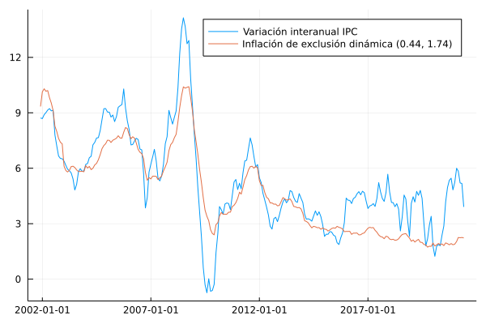
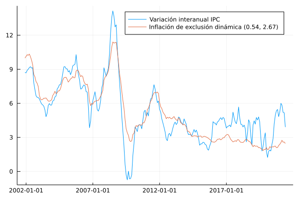

# Exclusión dinámica

En esta sección se documentan los resultados del proceso de evaluación de las medidas de inflación interanual basadas en la metodología de exclusión dinámica.

## Resultados de evaluación con criterios básicos a diciembre de 2019 modificando la metodología de remuestreo

### Exclusión dinámica con factores (0.4358, 1.7409)

| Medida                |    MSE | Error estándar |
|:--------------------- | ------:| --------------:|
| DynEx(0.4358, 1.7409) | 3.1298 |         0.0032 |

## Descomposición aditiva del MSE

### Exclusión dinámica con factores (0.4358, 1.7409)

| Medida                |    MSE | Comp. Sesgo | Comp. Varianza | Comp. Covarianza |
|:--------------------- | ------:| -----------:| --------------:| ----------------:|
| dynEx(0.4358, 1.7409) | 3.1299 |      0.2064 |         0.1770 |           2.7463 |

## Métricas de evaluación 

### Exclusión dinámica con factores (0.4358, 1.7409)
| Medida                |   RMSE | Error medio |    MAE |  Huber | Correlación |
|:--------------------- | ------:| -----------:| ------:| ------:| -----------:|
| dynEx(0.4358, 1.7409) | 0.7391 |     -0.3394 | 1.3525 | 0.9195 |      0.8010 |

## Trayectoria de inflación observada

## Resultados de evaluación con criterios básicos a diciembre de 2019 modificando la metodología de remuestreo y el parámetro de evaluación

### Exclusión dinámica con factores (0.4358, 1.7409)

| Medida                |    MSE | Error estándar |
|:--------------------- | ------:| --------------:|
| dynEx(0.4358, 1.7409) | 3.1299 |         0.0032 |

## Descomposición aditiva del MSE

### Exclusión dinámica con factores (0.4358, 1.7409)

| Medida                |    MSE | Comp. Sesgo | Comp. Varianza | Comp. Covarianza |
|:--------------------- | ------:| -----------:| --------------:| ----------------:|
| dynEx(0.4358, 1.7409) | 3.1299 |      0.1770 |         0.7463 |           0.2064 |

## Métricas de evaluación 

### Exclusión dinámica con factores (0.4358, 1.7409)
| Medida                |   RMSE | Error medio |    MAE |  Huber | Correlación |
|:--------------------- | ------:| -----------:| ------:| ------:| -----------:|
| dynEx(0.4358, 1.7409) | 1.7391 |     -0.3394 | 1.3525 | 0.9195 |      0.8010 |

## Trayectoria de inflación observada

## Resultados de evaluación con criterios básicos a diciembre de 2020 modificando la metodología de remuestreo

### Exclusión dinámica con factores (0.4339, 1.7497)

| Medida                |    MSE | Error estándar |
|:--------------------- | ------:| --------------:|
| DynEx(0.4339, 1.7497) | 3.0621 |         0.0030 |

## Descomposición aditiva del MSE

### Exclusión dinámica con factores (0.4339, 1.7497)

| Medida                |    MSE | Comp. Sesgo | Comp. Varianza | Comp. Covarianza |
|:--------------------- | ------:| -----------:| --------------:| ----------------:|
| dynEx(0.4339, 1.7497) | 3.0621 |      0.2244 |         0.2048 |           2.6329 |

## Métricas de evaluación 

### Exclusión dinámica con factores (0.4339, 1.7497)
| Medida                |   RMSE | Error medio |    MAE |  Huber | Correlación |
|:--------------------- | ------:| -----------:| ------:| ------:| -----------:|
| dynEx(0.4339, 1.7497) | 1.7223 |     -0.3678 | 1.3489 | 0.9141 |      0.8103 |

## Trayectoria de inflación observada

## Resultados de evaluación con criterios básicos a diciembre de 2020 modificando la metodología de remuestreo y el parámetro de evaluación

### Exclusión dinámica con factores (0.5415, 2.6652)

| Medida                |    MSE | Error estándar |
|:--------------------- | ------:| --------------:|
| DynEx(0.5415, 2.6652) | 3.3509 |         0.0033 |

## Descomposición aditiva del MSE

### Exclusión dinámica con factores (0.5415, 2.6652)

| Medida                |    MSE | Comp. Sesgo | Comp. Varianza | Comp. Covarianza |
|:--------------------- | ------:| -----------:| --------------:| ----------------:|
| dynEx(0.5415, 2.6652) | 3.3509 |      0.1242 |         0.2803 |           2.9465 |

## Métricas de evaluación 

### Exclusión dinámica con factores (0.5415, 2.6652)
| Medida                |   RMSE | Error medio |    MAE |  Huber | Correlación |
|:--------------------- | ------:| -----------:| ------:| ------:| -----------:|
| dynEx(0.5415, 2.6652) | 1.8031 |     -0.1432 | 1.4081 | 0.9755 |      0.8029 |

## Trayectoria de inflación observada

