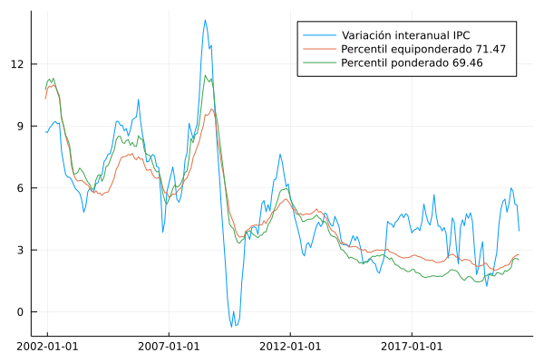

# Percentiles 

En esta sección se documentan los resultados del proceso de evaluación de las medidas de inflación interanual basadas en la metodología de percentiles ponderados y equiponderados.

## Resultados de evaluación con criterios básicos a diciembre de 2019 modificando la metodología de remuestreo

| Medida                        |    MSE | Error estándar |
| :---------------------------- | -----: | -------------: |
| Percentil equiponderado 71.23 | 2.6164 |         0.0024 |
| Percentil ponderado 67.79     | 3.7097 |         0.0033 |

### Descomposición aditiva del MSE

| Medida                        |    MSE | Comp. Sesgo | Comp. Varianza | Comp. Covarianza |
| :---------------------------- | -----: | ----------: | -------------: | ---------------: |
| Percentil equiponderado 71.23 | 2.6164 |      0.1099 |          0.157 |           2.3495 |
| Percentil ponderado 67.79     | 3.7097 |      0.3459 |         0.4133 |           2.9505 |

### Métricas de evaluación 

| Medida                        |   RMSE | Error medio |    MAE |  Huber | Correlación |
| :---------------------------- | -----: | ----------: | -----: | -----: | ----------: |
| Percentil equiponderado 71.23 |  1.596 |     -0.1817 | 1.2171 | 0.8061 |      0.8259 |
| Percentil ponderado 67.79     | 1.9023 |     -0.4862 | 1.5376 | 1.0926 |      0.8034 |

### Trayectorias de inflación observada

## Resultados de evaluación con criterios básicos a diciembre de 2019 modificando la metodología de remuestreo y el parámetro de evaluación

| Medida                        |    MSE | Error estándar |
| :---------------------------- | -----: | -------------: |
| Percentil equiponderado 71.43 | 2.8519 |         0.0025 |
| Percentil ponderado 69.5      | 3.9908 |         0.0035 |

### Descomposición aditiva del MSE

| Medida                        |    MSE | Comp. Sesgo | Comp. Varianza | Comp. Covarianza |
| :---------------------------- | -----: | ----------: | -------------: | ---------------: |
| Percentil equiponderado 71.43 | 2.8519 |      0.2209 |         0.1397 |           2.4913 |
| Percentil ponderado 69.5      | 3.9908 |      0.2352 |         0.5816 |            3.174 |

### Métricas de evaluación 

| Medida                        |   RMSE | Error medio |    MAE |  Huber | Correlación |
| :---------------------------- | -----: | ----------: | -----: | -----: | ----------: |
| Percentil equiponderado 71.43 | 1.6679 |     -0.3786 | 1.2948 | 0.8675 |        0.82 |
| Percentil ponderado 69.5      | 1.9736 |     -0.3437 | 1.5874 | 1.1422 |      0.8047 |

## Resultados de evaluación con criterios básicos a diciembre de 2020 modificando la metodología de remuestreo

| Medida                        |    MSE | Error estándar |
| :---------------------------- | -----: | -------------: |
| Percentil equiponderado 71.37 | 2.5587 |         0.0023 |
| Percentil ponderado 67.82     | 3.6545 |         0.0031 |

### Descomposición aditiva del MSE

| Medida                        |    MSE | Comp. Sesgo | Comp. Varianza | Comp. Covarianza |
| :---------------------------- | -----: | ----------: | -------------: | ---------------: |
| Percentil equiponderado 71.37 | 2.5587 |      0.1109 |         0.1762 |           2.2716 |
| Percentil ponderado 67.82     | 3.6545 |      0.3877 |         0.4431 |           2.8237 |

### Métricas de evaluación 

| Medida                        |   RMSE | Error medio |    MAE |  Huber | Correlación |
| :---------------------------- | -----: | ----------: | -----: | -----: | ----------: |
| Percentil equiponderado 71.37 | 1.5793 |     -0.1892 |  1.211 | 0.7982 |      0.8328 |
| Percentil ponderado 67.82     | 1.8898 |     -0.5295 | 1.5399 | 1.0924 |      0.8118 |

## Resultados de evaluación con criterios básicos a diciembre de 2020 modificando la metodología de remuestreo y el parámetro de evaluación

| Medida                        |    MSE | Error estándar |
| :---------------------------- | -----: | -------------: |
| Percentil equiponderado 71.47 | 2.8034 |         0.0024 |
| Percentil ponderado 69.46     | 3.9282 |         0.0033 |

### Descomposición aditiva del MSE

| Medida                        |    MSE | Comp. Sesgo | Comp. Varianza | Comp. Covarianza |
| :---------------------------- | -----: | ----------: | -------------: | ---------------: |
| Percentil equiponderado 71.47 | 2.8034 |      0.2388 |         0.1528 |           2.4118 |
| Percentil ponderado 69.46     | 3.9282 |       0.281 |          0.603 |           3.0442 |

### Métricas de evaluación 

| Medida                        |   RMSE | Error medio |    MAE |  Huber | Correlación |
| :---------------------------- | -----: | ----------: | -----: | -----: | ----------: |
| Percentil equiponderado 71.47 |  1.655 |      -0.404 | 1.2956 |  0.866 |      0.8269 |
| Percentil ponderado 69.46     | 1.9597 |     -0.4082 |  1.589 | 1.1414 |      0.8123 |

### Trayectorias de inflación observada

