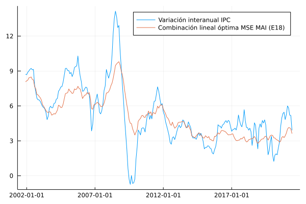

# Subyacente MAI 

En esta sección se documentan los resultados del proceso de evaluación de las medidas de inflación interanual basadas en la metodología de muestra ampliada implícitamente (MAI).

## Resultados de evaluación a diciembre de 2018

### Optimización de cuantiles de metodologías MAI-F, MAI-G, MAI-FP

| Medida                        |    MSE | Error estándar |
| :---------------------------- | -----: | -------------: |
| MAI (FP,4,[0.29, 0.81, 0.98]) | 1.8218 |         0.0018 |
| MAI (F,4,[0.29, 0.78, 0.98])  | 1.9305 |         0.0019 |
| MAI (G,4,[0.28, 0.39, 0.98])  | 2.1193 |         0.0022 |
| Combinación MAI               | 1.7257 |         0.0017 |

| Medida                        | Ponderador |
| ----------------------------- | ---------: |
| MAI (FP,4,[0.29, 0.81, 0.98]) |     0.7508 |
| MAI (F,4,[0.29, 0.78, 0.98])  |    -0.0208 |
| MAI (G,4,[0.28, 0.39, 0.98])  |     0.2834 |

### Descomposición aditiva del MSE

| Medida                        |    MSE | Comp. Sesgo | Comp. Varianza | Comp. Covarianza |
| :---------------------------- | -----: | ----------: | -------------: | ---------------: |
| MAI (F,4,[0.29, 0.78, 0.98])  | 1.9305 |      0.2099 |         0.0887 |           1.6319 |
| MAI (FP,4,[0.29, 0.81, 0.98]) | 1.8218 |      0.1801 |         0.0443 |           1.5973 |
| MAI (G,4,[0.28, 0.39, 0.98])  | 2.1193 |      0.1681 |         0.0886 |           1.8625 |
| Combinación MAI               | 1.7257 |      0.0798 |         0.0513 |           1.5945 |

### Métricas de evaluación 

| Medida                        |   RMSE | Error medio |    MAE |  Huber | Correlación |
| :---------------------------- | -----: | ----------: | -----: | -----: | ----------: |
| MAI (F,4,[0.29, 0.78, 0.98])  | 1.3678 |     -0.3213 | 1.0835 |   0.68 |      0.8791 |
| MAI (FP,4,[0.29, 0.81, 0.98]) | 1.3282 |     -0.3488 | 1.0239 | 0.6371 |      0.8673 |
| MAI (G,4,[0.28, 0.39, 0.98])  | 1.4341 |      0.2019 | 1.1006 | 0.7098 |      0.8439 |
| Combinación MAI               | 1.2933 |     -0.1166 | 0.9977 | 0.6119 |      0.8675 |

### Trayectoria de inflación observada

