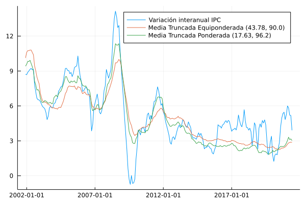

# Medias truncadas

En esta sección se documentan los resultados del proceso de evaluación de las medidas de inflación interanual basadas en la metodología de medias truncadas.

## Resultados de evaluación con criterios básicos a diciembre de 2018

| Medida            |    MSE | Error estándar |
| :---------------- | -----: | -------------: |
| MTEq-(43.78,90.0) | 2.9124 |         0.0027 |
| MTW-(17.63,96.2)  | 3.5497 |         0.0038 |

## Descomposición aditiva del MSE

| Medida            |    MSE | Comp. Sesgo | Comp. Varianza | Comp. Covarianza |
| :---------------- | -----: | ----------: | -------------: | ---------------: |
| MTEq-(43.78,90.0) | 2.9124 |      0.1417 |         0.1211 |           2.6497 |
| MTW-(17.63,96.2)  | 3.5497 |      0.2177 |         0.2443 |           3.0876 |

## Métricas de evaluación 

| Medida            |   RMSE | Error medio |    MAE |  Huber | Correlación |
| :---------------- | -----: | ----------: | -----: | -----: | ----------: |
| MTEq-(43.78,90.0) | 1.6826 |     -0.2461 | 1.2931 | 0.8717 |      0.7993 |
| MTW-(17.63,96.2)  | 1.8491 |     -0.3236 | 1.4555 | 1.0174 |      0.7853 |

## Trayectoria de inflación observada

