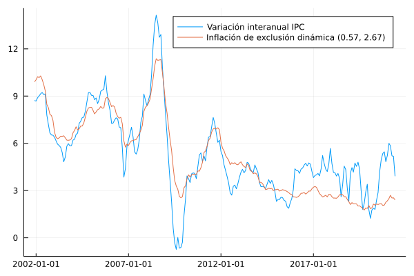

# Exclusión dinámica

En esta sección se documentan los resultados del proceso de evaluación de las medidas de inflación interanual basadas en la metodología de exclusión dinámica.

## Resultados de evaluación con criterios básicos a diciembre de 2018

### Exclusión dinámica con factores (0.5695, 2.6672)

| Medida                |    MSE | Error estándar |
|:--------------------- | ------:| --------------:|
| dynEx(0.5695, 2.6672) | 3.4968 |         0.0037 |

## Descomposición aditiva del MSE

### Exclusión dinámica con factores (0.5695, 2.6672)

| Medida                |    MSE | Comp. Sesgo | Comp. Varianza | Comp. Covarianza |
|:--------------------- | ------:| -----------:| --------------:| ----------------:|
| dynEx(0.5695, 2.6672) | 3.4968 |      0.1235 |         0.2241 |           3.1492 |

## Métricas de evaluación 

### Exclusión dinámica con factores (0.5695, 2.6672)
| Medida                |   RMSE | Error medio |    MAE |  Huber | Correlación |
|:--------------------- | ------:| -----------:| ------:| ------:| -----------:|
| dynEx(0.5695, 2.6672) | 1.8373 |     -0.1180 | 1.4246 | 0.9918 |      0.7795 |

## Trayectoria de inflación observada

