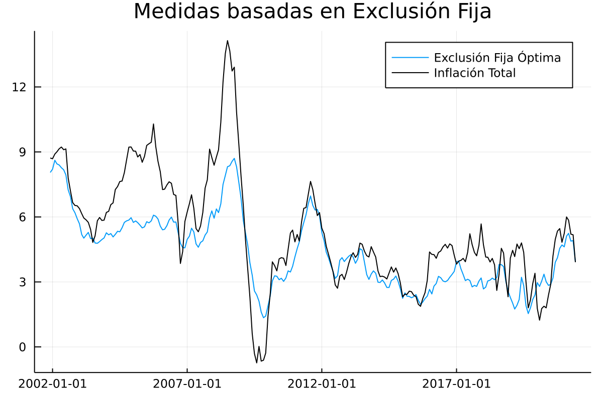

# Exclusión fija de gastos básicos

En esta sección se documentan los resultados del proceso de evaluación de las medidas de inflación interanual basadas en los métodos de exclusión fija de gastos básicos del IPC..

## Resultados de evaluación con criterios básicos a diciembre de 2018

### Resultados de evaluación 

| Medida                     |    MSE | Error Estándar |
| :------------------------- | -----: | -------------: |
| Exclusión Óptima           |  4.409 |          1.430 |

### Exclusión Fija Óptima

En total, luego del proceso de optimización, se excluyen 26 gastos básicos de la base 2000 y 5 gastos básicos de la Base 2010:

|  No.  | Gastos básicos excluidos en la base 2000 del IPC                               |
| :---: | :----------------------------------------------------------------------------- |
|    35 |                                                                        Cebolla |
|    30 |                                                                         Tomate |
|   190 |     Otras cuotas fijas y extraordinarias en la educaión preprimaria y primaria |
|    36 |                                                                  Papa o patata |
|    37 |                                                                      Zanahoria |
|    40 |                                                            Culantro o cilantro |
|    31 |                                                                       Güisquil |
|   104 | Gastos derivados del gas manufacturado y natural y gases licuados del petróleo |
|   162 |                                                               Transporte aéreo |
|    32 |                                                    Otras verduras y hortalizas |
|    33 |                                                                         Frijol |
|   159 |                                                                       Gasolina |
|   193 |                Otras cuotas fijas y extraordinarios en la educación secundaria |
|   161 |                                                              Transporte urbano |
|    50 |                                                                            Sal |
|   160 |                                                         Transporte extraurbano |
|    21 |                                                            Aceites y vegetales |
|   163 |                                               Servicio de correo internacional |
|     3 |                                                         Pastas frescas y secas |
|     4 |                                                       Productos de tortillería |
|    97 |                                  Materiales de hierro, zinc, metal y similares |
|     2 |                                                                            Pan |
|    27 |                                                                       Plátanos |
|     1 |                                                                          Arroz |
|   191 |                                                      Inscripción de secundaria |
|   188 |                                          Inscripción en preprimaria y primaria |

|  No.  | Gastos básicos excluidos en la base 2010 del IPC |
| :---: | :----------------------------------------------- |
|    29 |         Tomate |
|    46 |       Culantro |
|    39 |        Cebolla |
|    31 | Chile pimiento |
|   116 |    Gas propano |

### Descomposición aditiva del MSE

| Medida                     | Comp. Sesgo | Comp. Varianza | Comp. Covarianza |
| :------------------------- | ----------: | -------------: | ---------------: |
|      Exclusión Energéticos |    7.317 |    0.436 |    1.674 |    5.208 |
| Alimentos y energéticos 11 |    5.763 |    0.616 |    1.245 |    3.902 |
|           Exclusión Óptima |    4.409 |    1.246 |      0.1 |    3.062 |
|  Alimentos y Energéticos 9 |    6.099 |    3.499 |    0.239 |    2.362 |

### Métricas de evaluación 

| Medida                     |  RMSE |     ME |   MAE | Huber | Correlación |
| :------------------------- | ----: | -----: | ----: | ----: | ----------: |
|      Exclusión Energéticos |    2.662 |    0.406 |     1.92 |    1.492 |    0.715 |
| Alimentos y energéticos 11 |    2.361 |   -0.577 |    1.835 |     1.39 |    0.773 |
|           Exclusión Óptima |    2.072 |    -1.08 |     1.65 |    1.205 |    0.736 |
|  Alimentos y Energéticos 9 |    2.451 |    -1.85 |    2.118 |    1.641 |    0.835 |

### Trayectorias de inflación observada

